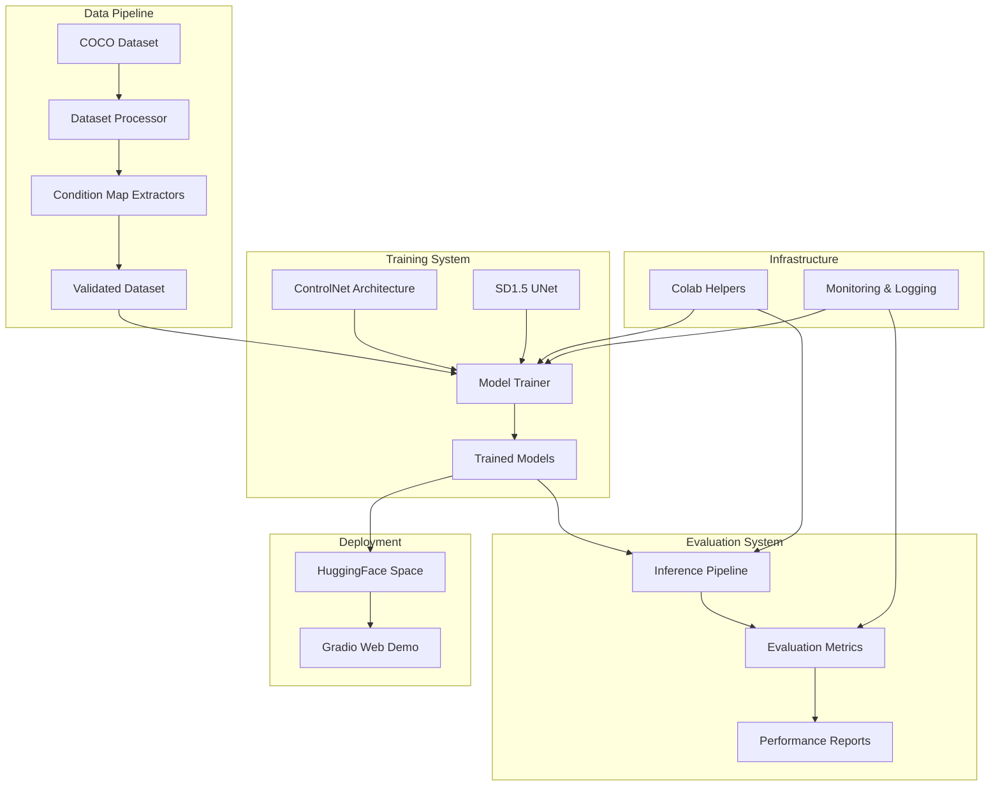
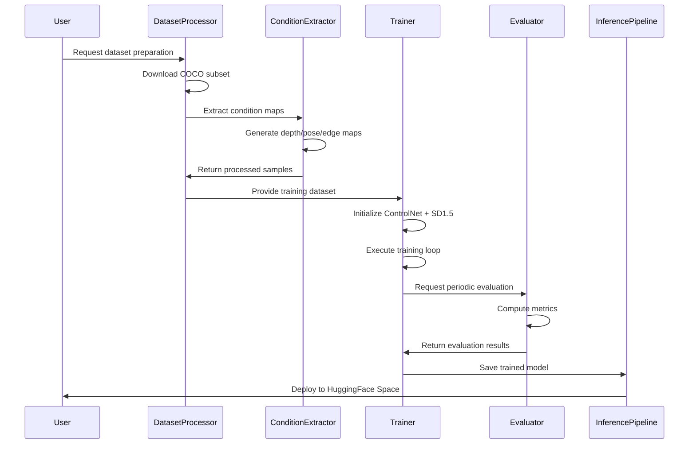

# Technical Design Document

## Overview

This document presents the technical design for a production-grade ControlNet training pipeline that enables spatial conditioning of Stable Diffusion 1.5 image generation. The system implements the architecture from "Adding Conditional Control to Text-to-Image Diffusion Models" (Zhang et al., 2023) and is optimized for Google Colab T4 GPU constraints (15GB VRAM).

The pipeline supports three conditioning types:
- **Depth conditioning**: Using depth maps for spatial structure control
- **Pose conditioning**: Using human pose skeletons for character positioning
- **Edge conditioning**: Using Canny edge maps for outline-based control

### Key Design Principles

1. **Memory Efficiency**: All components designed to fit within T4 GPU memory constraints
2. **Modularity**: Clear separation of concerns with well-defined interfaces
3. **Reproducibility**: Faithful implementation of the original ControlNet architecture
4. **Accessibility**: Beginner-friendly with comprehensive documentation and error handling
5. **Production Ready**: Robust error handling, logging, and deployment capabilities

## Architecture

### System Architecture Overview



### Core Components Architecture

The system follows a layered architecture with clear separation between data processing, model training, evaluation, and deployment:

#### 1. Data Layer
- **Dataset Processor**: Downloads and manages COCO 2017 subset
- **Condition Extractors**: Generate depth, pose, and edge maps
- **Data Validators**: Ensure data quality and completeness

#### 2. Model Layer
- **ControlNet Implementation**: Faithful reproduction of the original architecture
- **UNet Wrapper**: Integration layer for SD1.5 compatibility
- **Training Orchestrator**: Manages the training process across condition types

#### 3. Evaluation Layer
- **Metrics Calculator**: FID scores and condition alignment measurements
- **Visual Evaluator**: Generates comparison grids and quality assessments
- **Performance Monitor**: Tracks training progress and system health

#### 4. Deployment Layer
- **Inference Pipeline**: End-to-end image generation system
- **Web Interface**: Gradio-based demo for HuggingFace Spaces
- **Model Serialization**: HuggingFace Hub compatible model storage

## Components and Interfaces

### 1. Dataset Processing Components

#### DatasetProcessor Class
```python
class DatasetProcessor:
    """Manages COCO dataset download and preprocessing"""
    
    def download_coco_subset(self, subset_size: int = 10000) -> Path
    def validate_dataset_integrity(self) -> DatasetReport
    def create_train_val_split(self, val_ratio: float = 0.1) -> Tuple[Dataset, Dataset]
```

**Key Features:**
- Streaming download to handle large datasets in Colab
- Automatic retry mechanism for network failures
- Progress tracking with estimated completion times
- Memory-efficient processing using generators

#### ConditionMapExtractor Interface
```python
class ConditionMapExtractor(ABC):
    """Abstract base class for condition map extraction"""
    
    @abstractmethod
    def extract(self, image: PIL.Image) -> np.ndarray
    
    @abstractmethod
    def validate_output(self, condition_map: np.ndarray) -> bool
```

**Implementations:**
- **DepthExtractor**: Uses Intel DPT model for monocular depth estimation
- **PoseExtractor**: Uses DWPose for human pose detection
- **EdgeExtractor**: Uses OpenCV Canny edge detection with adaptive thresholding

### 2. ControlNet Architecture Components

#### ControlNet Implementation
```python
class ControlNet(nn.Module):
    """ControlNet adapter following Zhang et al. 2023"""
    
    def __init__(self, 
                 conditioning_channels: int = 3,
                 block_out_channels: Tuple[int, ...] = (320, 640, 1280, 1280)):
        # Encoder blocks matching SD1.5 UNet structure
        # Zero convolution layers for stable training
        # Skip connections for multi-resolution features
```

**Architecture Details:**
- **Encoder Structure**: Mirrors SD1.5 UNet encoder with ResNet and attention blocks
- **Zero Convolutions**: Initialized to zero for stable training start
- **Multi-Resolution Outputs**: Features at 1/8, 1/16, 1/32, 1/64 resolutions
- **Conditioning Input**: Flexible 1-3 channel input processing

#### UNet Integration Wrapper
```python
class ControlNetUNet(UNet2DConditionModel):
    """SD1.5 UNet with ControlNet integration"""
    
    def forward(self, 
                sample: torch.Tensor,
                timestep: torch.Tensor,
                encoder_hidden_states: torch.Tensor,
                controlnet_cond: Optional[torch.Tensor] = None,
                conditioning_scale: float = 1.0) -> UNet2DConditionOutput:
```

**Integration Strategy:**
- **Additive Combination**: ControlNet features added to UNet decoder layers
- **Conditioning Scale**: Adjustable strength of spatial conditioning
- **Backward Compatibility**: Maintains original SD1.5 behavior when no conditioning provided

### 3. Training System Components

#### Memory-Optimized Trainer
```python
class ControlNetTrainer:
    """Memory-efficient training orchestrator"""
    
    def __init__(self, 
                 condition_type: str,
                 batch_size: int = 1,  # Optimized for T4 GPU
                 gradient_accumulation_steps: int = 8,
                 mixed_precision: bool = True):
```

**Memory Optimization Strategies:**
- **Gradient Checkpointing**: Trades computation for memory
- **Mixed Precision (FP16)**: Reduces memory usage by ~50%
- **Gradient Accumulation**: Simulates larger batch sizes
- **Dynamic Batch Sizing**: Adjusts based on available memory

#### Training Loop Architecture
```python
def training_step(self, batch: Dict[str, torch.Tensor]) -> torch.Tensor:
    """Single training step with memory optimization"""
    
    # 1. Forward pass through ControlNet
    # 2. Noise prediction with conditioning
    # 3. Diffusion loss calculation
    # 4. Gradient accumulation and optimization
    # 5. Memory cleanup and monitoring
```

### 4. Evaluation and Monitoring Components

#### Evaluation Metrics Calculator
```python
class EvaluationMetrics:
    """Comprehensive model evaluation system"""
    
    def compute_fid_score(self, generated_images: List[PIL.Image], 
                         reference_images: List[PIL.Image]) -> float
    
    def compute_condition_alignment(self, generated_images: List[PIL.Image],
                                  condition_maps: List[np.ndarray]) -> float
    
    def generate_visual_comparison(self, samples: List[EvaluationSample]) -> PIL.Image
```

**Evaluation Methodology:**
- **FID Scores**: Measures distribution similarity using InceptionV3 features
- **Condition Alignment**: Quantifies adherence to spatial conditioning
- **Visual Quality Assessment**: Automated and manual evaluation protocols
- **Statistical Significance**: Confidence intervals and hypothesis testing

## Data Models

### Core Data Structures

#### Training Sample
```python
@dataclass
class TrainingSample:
    """Single training example"""
    image: PIL.Image
    prompt: str
    condition_map: np.ndarray
    condition_type: str
    metadata: Dict[str, Any]
    
    def validate(self) -> bool:
        """Validates sample integrity"""
        return (self.image is not None and 
                len(self.prompt.strip()) > 0 and
                self.condition_map.shape[-2:] == self.image.size[::-1])
```

#### Model Configuration
```python
@dataclass
class ControlNetConfig:
    """ControlNet model configuration"""
    condition_type: str
    conditioning_channels: int
    block_out_channels: Tuple[int, ...]
    attention_head_dim: int = 8
    cross_attention_dim: int = 768
    use_linear_projection: bool = False
    
    # Training hyperparameters
    learning_rate: float = 1e-5
    num_train_epochs: int = 100
    gradient_accumulation_steps: int = 8
    mixed_precision: bool = True
```

#### Evaluation Results
```python
@dataclass
class EvaluationResults:
    """Comprehensive evaluation metrics"""
    fid_score: float
    condition_alignment_score: float
    visual_quality_score: float
    inference_time_ms: float
    memory_usage_mb: float
    
    # Statistical measures
    confidence_interval: Tuple[float, float]
    sample_count: int
    evaluation_timestamp: datetime
```

### Data Flow Architecture



## Research Findings and Technical Decisions

### ControlNet Architecture Research

Based on analysis of the original paper "Adding Conditional Control to Text-to-Image Diffusion Models" (Zhang et al., 2023), several key architectural decisions were made:

#### Zero Convolution Strategy
The original paper emphasizes zero initialization of convolution layers to ensure stable training. This prevents the ControlNet from disrupting pre-trained SD1.5 weights during early training phases.

**Implementation Decision**: All ControlNet output layers use zero-initialized 1x1 convolutions with learnable scaling factors.

#### Multi-Resolution Feature Integration
ControlNet provides features at multiple resolutions (1/8, 1/16, 1/32, 1/64) to match UNet decoder layers. This enables both coarse and fine-grained spatial control.

**Implementation Decision**: Features are additively combined with UNet decoder outputs using learnable conditioning scales.

### Memory Optimization Research

#### T4 GPU Constraints Analysis
- **Available VRAM**: ~15GB total, ~13GB usable after system overhead
- **SD1.5 Model Size**: ~3.4GB in FP32, ~1.7GB in FP16
- **ControlNet Size**: ~361MB additional parameters
- **Training Overhead**: Gradients, optimizer states, activations

**Memory Budget Allocation**:
- Models (FP16): ~2.1GB
- Optimizer states: ~4.2GB  
- Gradients: ~2.1GB
- Activations (batch_size=1): ~3GB
- Buffer/overhead: ~1.6GB
- **Total**: ~13GB (within T4 limits)

#### Gradient Checkpointing Impact
Research shows gradient checkpointing reduces memory by 30-50% with 10-20% computational overhead. For T4 constraints, this trade-off is essential.

**Implementation Decision**: Enable gradient checkpointing for all transformer blocks in both UNet and ControlNet.

### Condition Map Extraction Research

#### Depth Estimation Models
Evaluated options:
- **MiDaS**: Good quality but slower inference
- **DPT (Dense Prediction Transformer)**: Best quality-speed balance
- **LeReS**: High accuracy but memory intensive

**Selected**: Intel DPT-Large for optimal quality within memory constraints.

#### Pose Detection Models  
Evaluated options:
- **OpenPose**: Classic but requires compilation
- **MediaPipe**: Fast but limited accuracy
- **DWPose**: State-of-the-art accuracy with reasonable speed

**Selected**: DWPose for production quality with fallback to MediaPipe for speed-critical applications.

### Training Strategy Research

#### Learning Rate Scheduling
Research on diffusion model fine-tuning suggests:
- **Initial LR**: 1e-5 (10x lower than typical vision models)
- **Warmup**: 1000 steps to prevent early instability
- **Decay**: Cosine annealing over training duration

#### Batch Size vs. Gradient Accumulation
For T4 GPU constraints:
- **Physical batch size**: 1 (memory limitation)
- **Effective batch size**: 8 (via gradient accumulation)
- **Global batch size**: 64 (across multiple training runs)

This approach maintains training stability while respecting memory constraints.

## Error Handling

### Comprehensive Error Management Strategy

The ControlNet training pipeline implements multi-layered error handling to ensure robust operation in the Colab environment:

#### 1. Data Processing Errors

**Dataset Download Failures**
```python
class DatasetDownloadError(Exception):
    """Raised when dataset download fails"""
    
    def __init__(self, message: str, retry_count: int, last_error: Exception):
        self.retry_count = retry_count
        self.last_error = last_error
        super().__init__(f"Dataset download failed after {retry_count} retries: {message}")
```

**Error Handling Strategy**:
- **Automatic Retry**: Up to 3 attempts with exponential backoff
- **Partial Recovery**: Continue with successfully downloaded samples
- **User Guidance**: Clear instructions for manual intervention
- **Fallback Options**: Alternative dataset sources or reduced dataset sizes

**Condition Map Extraction Failures**
```python
class ConditionExtractionError(Exception):
    """Raised when condition map extraction fails"""
    
    def __init__(self, condition_type: str, image_id: str, error_details: str):
        self.condition_type = condition_type
        self.image_id = image_id
        super().__init__(f"Failed to extract {condition_type} for image {image_id}: {error_details}")
```

**Recovery Mechanisms**:
- **Skip and Continue**: Log failure and process next sample
- **Alternative Methods**: Fallback extractors for critical failures
- **Quality Validation**: Reject malformed condition maps
- **Batch Processing**: Isolate failures to prevent cascade errors

#### 2. Training System Errors

**GPU Memory Management**
```python
class GPUMemoryError(Exception):
    """Raised when GPU memory is exhausted"""
    
    def __init__(self, current_usage: float, attempted_allocation: float):
        self.current_usage = current_usage
        self.attempted_allocation = attempted_allocation
        super().__init__(f"GPU OOM: {current_usage:.1f}GB used, tried to allocate {attempted_allocation:.1f}GB")
```

**Memory Recovery Strategies**:
- **Automatic Batch Size Reduction**: Halve batch size and retry
- **Gradient Checkpointing**: Enable if not already active  
- **Cache Clearing**: Clear PyTorch cache and retry operation
- **Graceful Degradation**: Reduce model precision or disable non-essential features

**Training Divergence Detection**
```python
class TrainingDivergenceError(Exception):
    """Raised when training metrics indicate divergence"""
    
    def __init__(self, loss_history: List[float], divergence_threshold: float):
        self.loss_history = loss_history
        self.divergence_threshold = divergence_threshold
        super().__init__(f"Training diverged: loss exceeded {divergence_threshold}")
```

**Divergence Recovery**:
- **Learning Rate Reduction**: Automatically reduce by factor of 10
- **Checkpoint Rollback**: Restore from last stable checkpoint
- **Hyperparameter Adjustment**: Modify training configuration
- **Early Stopping**: Prevent resource waste on failed runs

#### 3. Colab Environment Errors

**Session Management**
```python
class ColabSessionError(Exception):
    """Raised for Colab-specific issues"""
    
    def __init__(self, error_type: str, time_remaining: Optional[int] = None):
        self.error_type = error_type
        self.time_remaining = time_remaining
        super().__init__(f"Colab session error: {error_type}")
```

**Session Continuity Strategies**:
- **Automatic Checkpointing**: Save state every 30 minutes
- **Drive Integration**: Persistent storage for model weights and logs
- **Resume Detection**: Automatic training continuation after reconnection
- **Progress Preservation**: Maintain training history across sessions

#### 4. Model Deployment Errors

**HuggingFace Integration Failures**
```python
class DeploymentError(Exception):
    """Raised during model deployment"""
    
    def __init__(self, deployment_stage: str, error_details: str):
        self.deployment_stage = deployment_stage
        super().__init__(f"Deployment failed at {deployment_stage}: {error_details}")
```

**Deployment Recovery**:
- **Model Validation**: Verify model integrity before upload
- **Gradual Rollout**: Test with limited examples before full deployment
- **Rollback Capability**: Maintain previous working version
- **Health Monitoring**: Continuous deployment status checking

### Error Logging and Monitoring

**Structured Logging System**
```python
import logging
from datetime import datetime
from typing import Dict, Any

class ControlNetLogger:
    """Centralized logging for the training pipeline"""
    
    def __init__(self, log_level: str = "INFO"):
        self.logger = logging.getLogger("controlnet_pipeline")
        self.setup_handlers(log_level)
    
    def log_error(self, error: Exception, context: Dict[str, Any]):
        """Log errors with full context for debugging"""
        error_data = {
            "timestamp": datetime.now().isoformat(),
            "error_type": type(error).__name__,
            "error_message": str(error),
            "context": context,
            "stack_trace": traceback.format_exc()
        }
        self.logger.error(json.dumps(error_data, indent=2))
```

**Monitoring Integration**:
- **Weights & Biases**: Real-time error tracking and alerting
- **Local Logs**: Persistent error history in Colab environment
- **User Notifications**: Clear error messages with actionable guidance
- **Performance Metrics**: Error rates and recovery success tracking

## Testing Strategy

### Testing Approach Overview

The ControlNet training pipeline employs a comprehensive testing strategy that combines unit tests, integration tests, and specialized validation for machine learning components. Given the nature of this system involving deep learning models, large datasets, and GPU computations, the testing approach focuses on:

1. **Unit Tests**: Component-level validation with mocked dependencies
2. **Integration Tests**: End-to-end pipeline validation with real data samples
3. **Model Validation Tests**: Architecture correctness and training stability
4. **Performance Tests**: Memory usage and computational efficiency validation
5. **Deployment Tests**: HuggingFace Space compatibility and inference validation

### Unit Testing Strategy

**Component Isolation Testing**
```python
# Example: Dataset processor unit tests
class TestDatasetProcessor(unittest.TestCase):
    
    def setUp(self):
        self.processor = DatasetProcessor(config=test_config)
        self.mock_dataset = create_mock_coco_samples(count=10)
    
    def test_dataset_validation_with_valid_samples(self):
        """Test dataset validation with properly formatted samples"""
        result = self.processor.validate_dataset_integrity(self.mock_dataset)
        self.assertTrue(result.is_valid)
        self.assertEqual(result.valid_samples, 10)
    
    def test_dataset_validation_with_corrupted_samples(self):
        """Test handling of corrupted or invalid samples"""
        corrupted_dataset = self.mock_dataset.copy()
        corrupted_dataset[0]['image'] = None  # Simulate corruption
        
        result = self.processor.validate_dataset_integrity(corrupted_dataset)
        self.assertEqual(result.valid_samples, 9)
        self.assertEqual(len(result.errors), 1)
```

**Condition Map Extractor Testing**
```python
class TestConditionExtractors(unittest.TestCase):
    
    def test_depth_extraction_output_format(self):
        """Verify depth maps have correct format and value ranges"""
        extractor = DepthExtractor()
        test_image = create_test_image(512, 512)
        
        depth_map = extractor.extract(test_image)
        
        self.assertEqual(depth_map.shape, (512, 512, 1))
        self.assertTrue(0.0 <= depth_map.min() <= depth_map.max() <= 1.0)
    
    def test_pose_extraction_keypoint_validation(self):
        """Verify pose extraction produces valid keypoint structures"""
        extractor = PoseExtractor()
        test_image = create_test_image_with_person()
        
        pose_map = extractor.extract(test_image)
        
        self.assertIsInstance(pose_map, np.ndarray)
        self.assertEqual(pose_map.shape[-1], 3)  # RGB channels
        # Additional keypoint validation logic
```

### Integration Testing Strategy

**End-to-End Pipeline Testing**
```python
class TestTrainingPipeline(unittest.TestCase):
    
    def test_complete_training_workflow(self):
        """Test full training pipeline with minimal dataset"""
        # Setup minimal test environment
        config = create_test_config(
            dataset_size=50,
            num_epochs=2,
            batch_size=1
        )
        
        # Execute pipeline stages
        dataset = prepare_test_dataset(config)
        trainer = ControlNetTrainer(config)
        
        # Verify each stage completes successfully
        self.assertTrue(dataset.is_valid())
        
        # Run abbreviated training
        results = trainer.train(dataset, max_steps=10)
        
        # Validate training outputs
        self.assertIsNotNone(results.final_model)
        self.assertTrue(results.loss_decreased)
        self.assertLess(results.final_loss, results.initial_loss)
```

**Model Architecture Validation**
```python
class TestControlNetArchitecture(unittest.TestCase):
    
    def test_controlnet_output_shapes(self):
        """Verify ControlNet produces correctly shaped outputs"""
        controlnet = ControlNet(conditioning_channels=3)
        
        # Test with various input sizes
        for size in [256, 512, 768]:
            condition_input = torch.randn(1, 3, size, size)
            timestep = torch.randint(0, 1000, (1,))
            
            outputs = controlnet(condition_input, timestep)
            
            # Verify multi-resolution outputs
            expected_shapes = [
                (1, 320, size//8, size//8),
                (1, 640, size//16, size//16),
                (1, 1280, size//32, size//32),
                (1, 1280, size//64, size//64)
            ]
            
            for output, expected_shape in zip(outputs, expected_shapes):
                self.assertEqual(output.shape, expected_shape)
```

### Model Validation Testing

**Training Stability Tests**
```python
class TestTrainingStability(unittest.TestCase):
    
    def test_loss_convergence_behavior(self):
        """Verify training loss shows expected convergence patterns"""
        trainer = ControlNetTrainer(test_config)
        loss_history = []
        
        # Run training for stability analysis
        for step in range(100):
            loss = trainer.training_step(get_test_batch())
            loss_history.append(loss.item())
        
        # Analyze convergence patterns
        initial_loss = np.mean(loss_history[:10])
        final_loss = np.mean(loss_history[-10:])
        
        # Loss should decrease over time
        self.assertLess(final_loss, initial_loss)
        
        # Loss should not diverge (no NaN or infinite values)
        self.assertTrue(all(np.isfinite(loss_history)))
    
    def test_gradient_flow_validation(self):
        """Verify gradients flow properly through ControlNet"""
        model = ControlNet()
        optimizer = torch.optim.AdamW(model.parameters(), lr=1e-5)
        
        # Forward pass with dummy data
        condition_input = torch.randn(1, 3, 512, 512, requires_grad=True)
        outputs = model(condition_input, torch.tensor([500]))
        
        # Compute dummy loss and backpropagate
        loss = sum(output.sum() for output in outputs)
        loss.backward()
        
        # Verify gradients exist and are reasonable
        for name, param in model.named_parameters():
            if param.grad is not None:
                grad_norm = param.grad.norm().item()
                self.assertGreater(grad_norm, 0)
                self.assertTrue(np.isfinite(grad_norm))
```

### Performance Testing Strategy

**Memory Usage Validation**
```python
class TestMemoryEfficiency(unittest.TestCase):
    
    def test_training_memory_constraints(self):
        """Verify training fits within T4 GPU memory limits"""
        if not torch.cuda.is_available():
            self.skipTest("CUDA not available")
        
        # Clear GPU memory
        torch.cuda.empty_cache()
        initial_memory = torch.cuda.memory_allocated()
        
        # Initialize training components
        trainer = ControlNetTrainer(production_config)
        
        # Run training step and measure peak memory
        peak_memory = 0
        for _ in range(10):
            trainer.training_step(get_test_batch())
            current_memory = torch.cuda.memory_allocated()
            peak_memory = max(peak_memory, current_memory)
        
        # Verify memory usage is within T4 limits (13GB usable)
        memory_gb = peak_memory / (1024**3)
        self.assertLess(memory_gb, 13.0, f"Memory usage {memory_gb:.1f}GB exceeds T4 limit")
    
    def test_inference_speed_benchmarks(self):
        """Verify inference meets performance requirements"""
        pipeline = ControlNetInferencePipeline()
        
        # Benchmark inference time
        start_time = time.time()
        
        for _ in range(10):
            result = pipeline.generate(
                prompt="test prompt",
                condition_map=create_test_condition_map(),
                num_inference_steps=20
            )
        
        avg_time = (time.time() - start_time) / 10
        
        # Inference should complete within reasonable time (< 30 seconds on T4)
        self.assertLess(avg_time, 30.0, f"Inference time {avg_time:.1f}s too slow")
```

### Deployment Testing Strategy

**HuggingFace Space Compatibility**
```python
class TestDeploymentCompatibility(unittest.TestCase):
    
    def test_gradio_app_initialization(self):
        """Verify Gradio app initializes correctly"""
        app = create_gradio_app(test_models_path)
        
        # Test app components exist
        self.assertIsNotNone(app.interface)
        self.assertTrue(hasattr(app, 'generate_image'))
        
        # Test with sample inputs
        result = app.generate_image(
            image=create_test_image(),
            prompt="test prompt",
            condition_type="depth"
        )
        
        self.assertIsInstance(result, PIL.Image.Image)
    
    def test_model_serialization_compatibility(self):
        """Verify models can be saved and loaded correctly"""
        original_model = ControlNet()
        
        # Save model in HuggingFace format
        save_path = "test_model_output"
        original_model.save_pretrained(save_path)
        
        # Load model and verify equivalence
        loaded_model = ControlNet.from_pretrained(save_path)
        
        # Compare model outputs
        test_input = torch.randn(1, 3, 512, 512)
        timestep = torch.tensor([500])
        
        with torch.no_grad():
            original_output = original_model(test_input, timestep)
            loaded_output = loaded_model(test_input, timestep)
        
        # Verify outputs are identical
        for orig, loaded in zip(original_output, loaded_output):
            torch.testing.assert_close(orig, loaded, rtol=1e-5, atol=1e-5)
```

### Continuous Integration Strategy

**Automated Testing Pipeline**
```yaml
# .github/workflows/test.yml
name: ControlNet Pipeline Tests

on: [push, pull_request]

jobs:
  test:
    runs-on: ubuntu-latest
    
    steps:
    - uses: actions/checkout@v3
    
    - name: Set up Python
      uses: actions/setup-python@v4
      with:
        python-version: '3.9'
    
    - name: Install dependencies
      run: |
        pip install -r requirements.txt
        pip install pytest pytest-cov
    
    - name: Run unit tests
      run: pytest tests/unit/ -v --cov=src/
    
    - name: Run integration tests
      run: pytest tests/integration/ -v
    
    - name: Run model validation tests
      run: pytest tests/model/ -v
      
    - name: Generate coverage report
      run: pytest --cov=src/ --cov-report=xml
    
    - name: Upload coverage to Codecov
      uses: codecov/codecov-action@v3
```

**Test Data Management**
- **Synthetic Test Data**: Generated test images and condition maps for unit tests
- **Minimal Real Data**: Small subset of COCO data for integration tests
- **Mock Services**: Simulated external dependencies (HuggingFace Hub, W&B)
- **Deterministic Testing**: Fixed random seeds for reproducible test results

### Testing Infrastructure Requirements

**Test Environment Setup**
```python
# conftest.py - Pytest configuration
import pytest
import torch
import numpy as np
from pathlib import Path

@pytest.fixture(scope="session")
def test_config():
    """Provide test configuration for all tests"""
    return {
        "dataset_size": 100,
        "batch_size": 1,
        "num_epochs": 2,
        "learning_rate": 1e-5,
        "output_dir": "test_outputs",
        "log_level": "DEBUG"
    }

@pytest.fixture(autouse=True)
def setup_test_environment():
    """Setup clean test environment for each test"""
    # Set deterministic behavior
    torch.manual_seed(42)
    np.random.seed(42)
    
    # Clear GPU memory if available
    if torch.cuda.is_available():
        torch.cuda.empty_cache()
    
    yield
    
    # Cleanup after test
    if torch.cuda.is_available():
        torch.cuda.empty_cache()
```

This comprehensive testing strategy ensures the ControlNet training pipeline is robust, reliable, and performs correctly across different environments and use cases. The combination of unit tests, integration tests, and specialized ML validation provides confidence in the system's correctness and performance.
## Implementation Guidance

### Development Phases and Milestones

The ControlNet training pipeline implementation follows a phased approach to ensure systematic development and testing:

#### Phase 1: Foundation Setup (Week 1-2)
**Milestone: Basic Project Structure and Environment**

1. **Project Structure Creation**
   ```
   controlnet-training-pipeline/
   ├── src/
   │   ├── data/
   │   │   ├── __init__.py
   │   │   ├── dataset_processor.py
   │   │   ├── condition_extractors.py
   │   │   └── validators.py
   │   ├── models/
   │   │   ├── __init__.py
   │   │   ├── controlnet.py
   │   │   ├── unet_wrapper.py
   │   │   └── pipeline.py
   │   ├── training/
   │   │   ├── __init__.py
   │   │   ├── trainer.py
   │   │   ├── losses.py
   │   │   └── optimizers.py
   │   ├── evaluation/
   │   │   ├── __init__.py
   │   │   ├── metrics.py
   │   │   └── visualizers.py
   │   ├── utils/
   │   │   ├── __init__.py
   │   │   ├── colab_helpers.py
   │   │   ├── logging_utils.py
   │   │   └── memory_utils.py
   │   └── app/
   │       ├── __init__.py
   │       └── gradio_app.py
   ├── configs/
   │   ├── base_config.py
   │   ├── depth_config.py
   │   ├── pose_config.py
   │   └── edge_config.py
   ├── notebooks/
   │   ├── 01_setup_and_data_preparation.ipynb
   │   ├── 02_model_training.ipynb
   │   ├── 03_evaluation_and_testing.ipynb
   │   └── 04_deployment.ipynb
   ├── tests/
   ├── requirements.txt
   ├── setup.py
   └── README.md
   ```

2. **Dependency Management**
   ```python
   # requirements.txt - Pinned versions for Colab compatibility
   torch==2.0.1+cu118
   torchvision==0.15.2+cu118
   diffusers==0.21.4
   transformers==4.35.2
   accelerate==0.24.1
   datasets==2.14.6
   opencv-python==4.8.1.78
   pillow==10.0.1
   numpy==1.24.3
   gradio==3.50.2
   wandb==0.16.0
   huggingface-hub==0.17.3
   ```

3. **Configuration System**
   ```python
   # configs/base_config.py
   from dataclasses import dataclass
   from typing import Tuple, Optional
   
   @dataclass
   class BaseConfig:
       # Model configuration
       model_name: str = "runwayml/stable-diffusion-v1-5"
       controlnet_conditioning_channels: int = 3
       
       # Training configuration
       learning_rate: float = 1e-5
       num_train_epochs: int = 100
       train_batch_size: int = 1
       gradient_accumulation_steps: int = 8
       mixed_precision: str = "fp16"
       
       # Memory optimization
       enable_gradient_checkpointing: bool = True
       enable_cpu_offload: bool = False
       
       # Data configuration
       dataset_name: str = "detection-datasets/coco"
       max_train_samples: int = 10000
       resolution: int = 512
       
       # Logging and checkpointing
       output_dir: str = "./outputs"
       logging_dir: str = "./logs"
       save_steps: int = 1000
       eval_steps: int = 500
       
       # Colab specific
       use_drive_storage: bool = True
       drive_mount_path: str = "/content/drive"
   ```

#### Phase 2: Data Pipeline Implementation (Week 2-3)
**Milestone: Complete Data Processing System**

1. **Dataset Processor Implementation**
   ```python
   # src/data/dataset_processor.py
   class DatasetProcessor:
       def __init__(self, config: BaseConfig):
           self.config = config
           self.logger = setup_logger("dataset_processor")
       
       def prepare_dataset(self) -> Tuple[Dataset, Dataset]:
           """Main entry point for dataset preparation"""
           # Download COCO subset
           raw_dataset = self._download_coco_subset()
           
           # Extract condition maps
           processed_dataset = self._extract_condition_maps(raw_dataset)
           
           # Validate and clean
           validated_dataset = self._validate_dataset(processed_dataset)
           
           # Create train/val split
           return self._create_splits(validated_dataset)
   ```

2. **Condition Map Extractors**
   ```python
   # src/data/condition_extractors.py
   class DepthExtractor(ConditionMapExtractor):
       def __init__(self):
           self.model = DPTForDepthEstimation.from_pretrained(
               "Intel/dpt-large", torch_dtype=torch.float16
           )
           self.processor = DPTImageProcessor.from_pretrained("Intel/dpt-large")
       
       def extract(self, image: PIL.Image) -> np.ndarray:
           inputs = self.processor(images=image, return_tensors="pt")
           
           with torch.no_grad():
               outputs = self.model(**inputs)
               depth = outputs.predicted_depth
           
           # Normalize to [0, 1] range
           depth = (depth - depth.min()) / (depth.max() - depth.min())
           return depth.cpu().numpy()
   ```

#### Phase 3: Model Architecture Implementation (Week 3-4)
**Milestone: Working ControlNet and UNet Integration**

1. **ControlNet Architecture**
   ```python
   # src/models/controlnet.py
   class ControlNet(ModelMixin, ConfigMixin):
       @register_to_config
       def __init__(
           self,
           in_channels: int = 4,
           conditioning_channels: int = 3,
           block_out_channels: Tuple[int] = (320, 640, 1280, 1280),
           attention_head_dim: int = 8,
       ):
           super().__init__()
           
           # Conditioning input processing
           self.conv_in = nn.Conv2d(
               conditioning_channels, block_out_channels[0], 
               kernel_size=3, padding=1
           )
           
           # Encoder blocks (mirror UNet structure)
           self.down_blocks = nn.ModuleList([])
           # ... implementation details
           
           # Zero convolution outputs
           self.controlnet_down_blocks = nn.ModuleList([])
           for i, channel in enumerate(block_out_channels):
               zero_conv = zero_module(nn.Conv2d(channel, channel, 1))
               self.controlnet_down_blocks.append(zero_conv)
   ```

2. **UNet Integration Wrapper**
   ```python
   # src/models/unet_wrapper.py
   class ControlNetUNet(UNet2DConditionModel):
       def forward(
           self,
           sample: torch.FloatTensor,
           timestep: Union[torch.Tensor, float, int],
           encoder_hidden_states: torch.Tensor,
           controlnet_cond: Optional[torch.FloatTensor] = None,
           conditioning_scale: float = 1.0,
       ):
           # Get ControlNet features if conditioning provided
           if controlnet_cond is not None:
               controlnet_features = self.controlnet(
                   controlnet_cond, timestep, encoder_hidden_states
               )
           else:
               controlnet_features = [None] * len(self.down_blocks)
           
           # Standard UNet forward with ControlNet integration
           # ... implementation with additive feature combination
   ```

#### Phase 4: Training System Implementation (Week 4-5)
**Milestone: Memory-Optimized Training Loop**

1. **Training Orchestrator**
   ```python
   # src/training/trainer.py
   class ControlNetTrainer:
       def __init__(self, config: BaseConfig, condition_type: str):
           self.config = config
           self.condition_type = condition_type
           
           # Initialize models with memory optimization
           self._setup_models()
           self._setup_optimizer()
           self._setup_memory_optimization()
       
       def train(self, train_dataset: Dataset, val_dataset: Dataset):
           """Main training loop with Colab optimizations"""
           
           # Setup training components
           train_dataloader = self._create_dataloader(train_dataset)
           lr_scheduler = self._create_scheduler()
           
           # Training loop with checkpointing
           for epoch in range(self.config.num_train_epochs):
               self._train_epoch(train_dataloader, lr_scheduler)
               
               if epoch % self.config.eval_steps == 0:
                   self._evaluate(val_dataset)
               
               # Colab session management
               self._handle_colab_session()
   ```

2. **Memory Optimization Utilities**
   ```python
   # src/utils/memory_utils.py
   class MemoryOptimizer:
       @staticmethod
       def optimize_for_t4():
           """Apply T4-specific optimizations"""
           torch.backends.cudnn.benchmark = True
           torch.backends.cuda.matmul.allow_tf32 = True
           
       @staticmethod
       def clear_cache():
           """Clear GPU memory cache"""
           if torch.cuda.is_available():
               torch.cuda.empty_cache()
               torch.cuda.synchronize()
       
       @staticmethod
       def get_memory_stats() -> Dict[str, float]:
           """Get current GPU memory usage"""
           if not torch.cuda.is_available():
               return {"allocated": 0, "reserved": 0, "free": 0}
           
           allocated = torch.cuda.memory_allocated() / 1024**3
           reserved = torch.cuda.memory_reserved() / 1024**3
           free = (torch.cuda.get_device_properties(0).total_memory / 1024**3) - reserved
           
           return {"allocated": allocated, "reserved": reserved, "free": free}
   ```

#### Phase 5: Evaluation and Monitoring (Week 5-6)
**Milestone: Comprehensive Evaluation System**

1. **Metrics Implementation**
   ```python
   # src/evaluation/metrics.py
   class EvaluationMetrics:
       def __init__(self):
           self.fid_calculator = FIDCalculator()
           self.alignment_calculator = ConditionAlignmentCalculator()
       
       def compute_comprehensive_metrics(
           self, 
           generated_images: List[PIL.Image],
           reference_images: List[PIL.Image],
           condition_maps: List[np.ndarray],
           prompts: List[str]
       ) -> EvaluationResults:
           """Compute all evaluation metrics"""
           
           results = EvaluationResults()
           
           # FID Score
           results.fid_score = self.fid_calculator.compute(
               generated_images, reference_images
           )
           
           # Condition Alignment
           results.condition_alignment = self.alignment_calculator.compute(
               generated_images, condition_maps
           )
           
           # Additional metrics...
           return results
   ```

#### Phase 6: Deployment and Demo (Week 6-7)
**Milestone: HuggingFace Space Deployment**

1. **Gradio Application**
   ```python
   # src/app/gradio_app.py
   def create_controlnet_demo():
       """Create HuggingFace Space compatible demo"""
       
       def generate_image(
           input_image: PIL.Image,
           prompt: str,
           condition_type: str,
           num_steps: int = 20,
           guidance_scale: float = 7.5,
           conditioning_scale: float = 1.0
       ):
           # Extract condition map
           condition_map = extract_condition_map(input_image, condition_type)
           
           # Generate image
           pipeline = load_pipeline(condition_type)
           generated_image = pipeline(
               prompt=prompt,
               image=condition_map,
               num_inference_steps=num_steps,
               guidance_scale=guidance_scale,
               controlnet_conditioning_scale=conditioning_scale
           ).images[0]
           
           return condition_map, generated_image
       
       # Create Gradio interface
       interface = gr.Interface(
           fn=generate_image,
           inputs=[
               gr.Image(type="pil", label="Input Image"),
               gr.Textbox(label="Text Prompt"),
               gr.Dropdown(["depth", "pose", "edge"], label="Condition Type"),
               gr.Slider(10, 50, value=20, label="Inference Steps"),
               gr.Slider(1.0, 20.0, value=7.5, label="Guidance Scale"),
               gr.Slider(0.0, 2.0, value=1.0, label="Conditioning Scale")
           ],
           outputs=[
               gr.Image(type="pil", label="Condition Map"),
               gr.Image(type="pil", label="Generated Image")
           ],
           title="ControlNet Image Generation",
           description="Generate images with spatial conditioning using ControlNet"
       )
       
       return interface
   ```

### Key Implementation Considerations

#### 1. Memory Management Strategy
- **Gradient Checkpointing**: Essential for T4 GPU constraints
- **Mixed Precision**: FP16 training reduces memory by ~50%
- **Batch Size Optimization**: Start with batch_size=1, use gradient accumulation
- **Model Offloading**: CPU offload for non-active model components

#### 2. Colab-Specific Optimizations
- **Session Management**: Automatic checkpointing every 30 minutes
- **Drive Integration**: Persistent storage for models and logs
- **Progress Tracking**: Visual progress bars and ETA calculations
- **Error Recovery**: Automatic resume from checkpoints

#### 3. Training Stability
- **Learning Rate Scheduling**: Warmup + cosine annealing
- **Gradient Clipping**: Prevent gradient explosion
- **Loss Monitoring**: Early stopping for divergence detection
- **Checkpoint Strategy**: Save best model based on validation metrics

#### 4. Quality Assurance
- **Automated Testing**: Unit tests for all components
- **Integration Testing**: End-to-end pipeline validation
- **Performance Benchmarking**: Memory and speed profiling
- **Model Validation**: Architecture correctness verification

This implementation guidance provides a structured approach to building the ControlNet training pipeline while addressing the specific constraints and requirements of the Colab environment. Each phase builds upon the previous one, ensuring a solid foundation for the complete system.