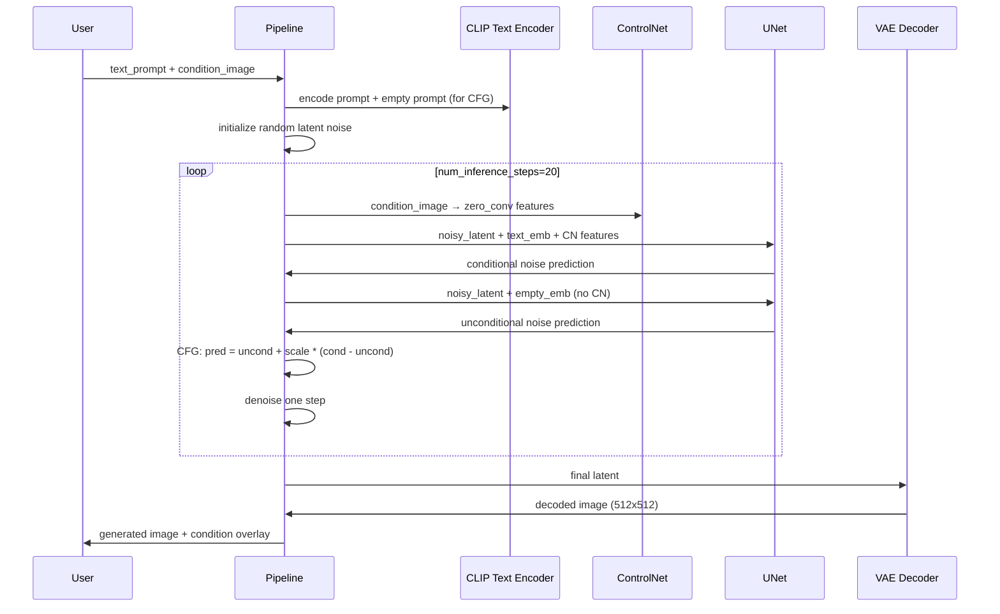

# Technical Design Document

## Overview

This document presents the technical design for the ControlNet model architecture and three training loops. The system implements the ControlNet adapter from "Adding Conditional Control to Text-to-Image Diffusion Models" (Zhang et al., 2023) on top of Stable Diffusion 1.5, optimized for Google Colab T4 GPU (15GB VRAM).

The implementation consists of four core files:
- `model/controlnet.py` — ControlNet adapter architecture (~360M trainable params)
- `model/pipeline.py` — Full inference pipeline with classifier-free guidance
- `training/losses.py` — Diffusion MSE loss with conditioning
- `training/train_depth.py`, `training/train_pose.py`, `training/train_edge.py` — Three condition-specific training scripts

### Key Design Principles

1. **Minimal Trainable Parameters**: Only ~360M adapter params are trained; the full SD1.5 UNet (~860M) stays frozen
2. **Zero Convolution Stability**: Training starts identical to vanilla SD1.5 and gradually learns conditioning
3. **T4 Memory Efficiency**: FP16 mixed precision + gradient checkpointing + no UNet backprop = fits in 15GB
4. **Shared Infrastructure**: All three training scripts share the same loop, differing only in condition_type

## Architecture

### System Architecture

```
┌─────────────────────────────────────────────────────────────────────┐
│                    ControlNet Training System                         │
├─────────────────────────────────────────────────────────────────────┤
│                                                                       │
│   Condition Image (depth/pose/edge)                                   │
│         │                                                             │
│         ▼                                                             │
│   ┌─────────────────────────────────────────────┐                    │
│   │  ControlNet Encoder — trainable copy of      │                    │
│   │  SD1.5 encoder + condition_embedding layer   │                    │
│   │  (~360M trainable parameters)                │                    │
│   └─────────────────┬───────────────────────────┘                    │
│                     │ (zero convolutions — 1x1 conv, init to 0)      │
│                     ▼                                                 │
│   ┌─────────────────────────────────────────────┐                    │
│   │  SD1.5 UNet — completely frozen              │                    │
│   │  (weights NEVER change, no gradients)        │                    │
│   │  (~860M frozen parameters)                   │                    │
│   └─────────────────┬───────────────────────────┘                    │
│                     │                                                 │
│                     ▼                                                 │
│              Generated Image                                          │
│                                                                       │
├─────────────────────────────────────────────────────────────────────┤
│  Training Loop (shared across depth/pose/edge):                       │
│  1. VAE encode image → latent                                         │
│  2. Add noise at random timestep                                      │
│  3. CLIP encode text prompt                                           │
│  4. ControlNet encode condition image                                 │
│  5. Predict noise with ControlNet-modified UNet                       │
│  6. MSE loss → backprop ONLY through ControlNet adapter               │
└─────────────────────────────────────────────────────────────────────┘
```

### Data Flow During Training

```mermaid
sequenceDiagram
    participant D as Dataset
    participant VAE as VAE Encoder (frozen)
    participant CLIP as CLIP Text Encoder (frozen)
    participant CN as ControlNet Adapter (trainable)
    participant UNet as SD1.5 UNet (frozen)
    participant Loss as MSE Loss

    D->>VAE: source image
    VAE->>VAE: encode to latent (64x64)
    D->>CLIP: text prompt
    CLIP->>CLIP: encode to embeddings (77x768)
    D->>CN: condition image (512x512x3)
    Note over VAE: Add noise at random timestep t
    CN->>UNet: zero_conv outputs (skip connections)
    UNet->>Loss: predicted noise
    Note over Loss: MSE(predicted_noise, actual_noise)
    Loss->>CN: gradients flow ONLY here
    Note over UNet,VAE,CLIP: NO gradients — completely frozen
```

### Data Flow During Inference



## Components and Interfaces

### 1. ControlNet Adapter (`model/controlnet.py`)

```python
class ControlNet(nn.Module):
    """
    ControlNet adapter for Stable Diffusion 1.5.
    
    Architecture:
    - condition_embedding: Conv2d that projects condition image (3ch) 
      into latent space (4ch, 64x64)
    - encoder_blocks: Copied from SD1.5 UNet encoder (frozen weights)
    - zero_convs: 1x1 Conv2d layers initialized to zero (trainable)
    - mid_block: Copied middle block from UNet (frozen)
    """
    
    def __init__(
        self,
        unet: UNet2DConditionModel,
        condition_channels: int = 3,
    ):
        """
        Args:
            unet: Pretrained SD1.5 UNet to copy encoder from
            condition_channels: Number of input channels for condition image (3 for RGB)
        """
        ...
    
    def forward(
        self,
        noisy_latent: torch.Tensor,      # (B, 4, 64, 64)
        timestep: torch.Tensor,           # (B,)
        text_embedding: torch.Tensor,     # (B, 77, 768)
        condition_image: torch.Tensor,    # (B, 3, 512, 512)
    ) -> torch.Tensor:
        """
        Returns: Modified UNet output (B, 4, 64, 64) — predicted noise
        """
        ...
```

**Key Implementation Details:**
- `condition_embedding`: A small CNN (e.g., 4 conv layers) that downsamples the 512x512 condition image to 64x64 with 4 channels, matching the noisy latent dimensions
- `encoder_blocks`: Deep-copied from `unet.down_blocks` and `unet.mid_block`, then frozen with `requires_grad_(False)`
- `zero_convs`: One `nn.Conv2d(ch, ch, 1)` per encoder block output, initialized with `nn.init.zeros_`
- The forward pass concatenates or adds the condition embedding to the noisy latent, runs through the copied encoder, applies zero convolutions, then injects these into the frozen UNet's decoder via skip connections

### 2. Inference Pipeline (`model/pipeline.py`)

```python
class ControlNetPipeline:
    """
    Full inference pipeline: text_prompt + condition_image → generated_image
    
    Supports all 3 condition types via condition_type argument.
    Uses classifier-free guidance (CFG) for quality.
    """
    
    def __init__(
        self,
        controlnet: ControlNet,
        unet: UNet2DConditionModel,
        vae: AutoencoderKL,
        text_encoder: CLIPTextModel,
        tokenizer: CLIPTokenizer,
        scheduler: DDIMScheduler,
    ):
        ...
    
    def __call__(
        self,
        text_prompt: str,
        condition_image: PIL.Image,
        condition_type: str = "depth",  # "depth", "pose", "edge"
        guidance_scale: float = 7.5,
        num_inference_steps: int = 20,
        seed: Optional[int] = None,
    ) -> PIL.Image:
        """
        Generate an image conditioned on text and spatial control.
        
        Classifier-Free Guidance (CFG):
        - Run UNet twice: once with conditioning, once without
        - Final prediction = uncond + guidance_scale * (cond - uncond)
        - Higher guidance_scale = stronger adherence to prompt/condition
        """
        ...
    
    def save_with_overlay(
        self,
        generated: PIL.Image,
        condition: PIL.Image,
        condition_type: str,
        output_path: str,
    ):
        """Save side-by-side composite: condition | generated, with label."""
        ...
```

### 3. Diffusion Loss (`training/losses.py`)

```python
def compute_diffusion_loss(
    model_pred: torch.Tensor,    # Predicted noise from ControlNet+UNet
    noise: torch.Tensor,         # Actual noise that was added
    timesteps: torch.Tensor,     # Diffusion timesteps
    step: int,                   # Current training step (for logging)
) -> torch.Tensor:
    """
    Diffusion Training Loss:
    ─────────────────────────
    We add random Gaussian noise to the image latent at a random timestep t.
    The model's job is to predict WHAT noise was added.
    The condition image guides the model toward reconstructing the RIGHT image.
    
    Loss = MSE(predicted_noise, actual_noise)
    
    This is the standard epsilon-prediction objective from DDPM.
    The condition doesn't appear in the loss directly — it enters through
    the model's forward pass, biasing the noise prediction toward the
    conditioned image.
    """
    loss = F.mse_loss(model_pred, noise, reduction="mean")
    
    if step % 10 == 0:
        print(f"[Step {step}] Loss: {loss.item():.6f}")
    
    return loss
```

### 4. Training Script Structure (`training/train_depth.py`)

```python
def train_depth():
    """
    Training script for depth-conditioned ControlNet.
    
    ⚠️ WARNING: Estimated training time on T4 GPU is ~3 hours.
    Consider splitting across multiple Colab sessions.
    Use checkpoint saving (every 250 steps) to resume.
    
    Architecture:
    - SD1.5 VAE (frozen) — encodes images to latent space
    - SD1.5 UNet (frozen) — predicts noise, receives ControlNet features
    - CLIP text encoder (frozen) — encodes text prompts
    - ControlNet adapter (TRAINABLE) — learns spatial conditioning
    
    Optimizer: AdamW, lr=1e-5, cosine schedule
    Precision: FP16 mixed precision (halves VRAM usage)
    Gradient clipping: max_norm=1.0 (prevents exploding gradients)
    Logging: W&B — loss, lr, samples every 250 steps
    Checkpoints: Google Drive every 250 steps
    Final: Upload to HuggingFace Hub "{username}/controlnet-sd15-depth"
    """
    
    # 1. Load frozen models
    vae = AutoencoderKL.from_pretrained(...).requires_grad_(False)
    unet = UNet2DConditionModel.from_pretrained(...).requires_grad_(False)
    text_encoder = CLIPTextModel.from_pretrained(...).requires_grad_(False)
    
    # 2. Create trainable ControlNet
    controlnet = ControlNet(unet, condition_channels=3)
    
    # 3. Optimizer and scheduler
    optimizer = torch.optim.AdamW(
        controlnet.parameters(),  # ONLY ControlNet params
        lr=1e-5,
        betas=(0.9, 0.999),
        weight_decay=1e-2,
    )
    lr_scheduler = get_cosine_schedule_with_warmup(optimizer, ...)
    
    # 4. Mixed precision scaler
    scaler = torch.cuda.amp.GradScaler()
    
    # 5. Training loop
    for step, batch in enumerate(dataloader):
        with torch.autocast("cuda", dtype=torch.float16):
            # FP16 mixed precision — halves VRAM usage by storing
            # activations in float16 instead of float32
            
            latents = vae.encode(batch["image"]).latent_dist.sample()
            noise = torch.randn_like(latents)
            timesteps = torch.randint(0, 1000, (B,))
            noisy_latents = scheduler.add_noise(latents, noise, timesteps)
            
            text_emb = text_encoder(batch["input_ids"]).last_hidden_state
            
            noise_pred = controlnet(
                noisy_latents, timesteps, text_emb, batch["condition"]
            )
            
            loss = compute_diffusion_loss(noise_pred, noise, timesteps, step)
        
        # Backprop — gradients flow ONLY through ControlNet
        scaler.scale(loss).backward()
        
        # Gradient clipping at 1.0 — prevents exploding gradients
        # that can destabilize training, especially early on
        scaler.unscale_(optimizer)
        torch.nn.utils.clip_grad_norm_(controlnet.parameters(), max_norm=1.0)
        
        scaler.step(optimizer)
        scaler.update()
        lr_scheduler.step()
        optimizer.zero_grad()
        
        # Log and checkpoint every 250 steps
        if step % 250 == 0:
            wandb.log({"loss": loss.item(), "lr": lr_scheduler.get_last_lr()[0]})
            save_checkpoint(controlnet, optimizer, step, drive_path)
            log_sample_images(controlnet, ...)
    
    # Upload to HuggingFace Hub
    controlnet.save_pretrained(f"{username}/controlnet-sd15-depth")
    upload_to_hub(f"{username}/controlnet-sd15-depth")
```

The `train_pose.py` and `train_edge.py` scripts are identical except:
- `condition_type = "pose"` / `"edge"`
- HuggingFace repo name: `controlnet-sd15-pose` / `controlnet-sd15-edge`
- Dataset loading uses pose/edge condition maps

## Data Models

### Core Tensors

| Tensor | Shape | Description |
|--------|-------|-------------|
| `noisy_latent` | (B, 4, 64, 64) | VAE-encoded image with added noise |
| `condition_image` | (B, 3, 512, 512) | RGB condition map (depth/pose/edge) |
| `condition_embedding` | (B, 4, 64, 64) | Condition projected to latent space |
| `text_embedding` | (B, 77, 768) | CLIP text encoder output |
| `timestep` | (B,) | Diffusion timestep (0-999) |
| `noise` | (B, 4, 64, 64) | Gaussian noise added to latent |
| `noise_pred` | (B, 4, 64, 64) | Model's predicted noise |
| `zero_conv_outputs` | List of (B, C, H, W) | Multi-scale features from zero convs |

### Training Configuration

```python
@dataclass
class TrainConfig:
    condition_type: str          # "depth", "pose", "edge"
    learning_rate: float = 1e-5
    optimizer: str = "adamw"
    betas: Tuple = (0.9, 0.999)
    weight_decay: float = 1e-2
    lr_schedule: str = "cosine"
    max_grad_norm: float = 1.0
    mixed_precision: bool = True  # FP16
    checkpoint_every: int = 250
    log_every: int = 250
    loss_log_every: int = 10
    hub_repo: str = ""           # e.g. "user/controlnet-sd15-depth"
    drive_checkpoint_path: str = "/content/drive/MyDrive/controlnet_checkpoints"
```

## Correctness Properties

### Property 1: Frozen Parameters Receive No Gradients

**Validates:** Requirements 2.3, 5.9, 9.3

After any backward pass during training, ALL parameters in the SD1.5 UNet, VAE, and CLIP text encoder must have `grad` equal to `None`. Only ControlNet adapter parameters should accumulate gradients.

```python
# After loss.backward():
for param in unet.parameters():
    assert param.grad is None
for param in vae.parameters():
    assert param.grad is None
for param in text_encoder.parameters():
    assert param.grad is None
# ControlNet params SHOULD have gradients:
for param in controlnet.trainable_parameters():
    assert param.grad is not None
```

### Property 2: Zero Convolution Initialization Produces Zero Output

**Validates:** Requirements 8.1, 8.2

At initialization, all zero convolution layers must have weights and biases equal to zero. For ANY input tensor, the output of a freshly initialized zero convolution must be a tensor of all zeros.

```python
# For any zero_conv layer at init:
assert zero_conv.weight.sum() == 0
assert zero_conv.bias.sum() == 0

# For any input x:
output = zero_conv(x)
assert output.abs().max() == 0  # All zeros
```

### Property 3: Output Shape Consistency

**Validates:** Requirements 2.5, 2.6

The ControlNet forward pass must produce output with the same shape as the input noisy latent, regardless of the specific values of the inputs (as long as shapes are correct).

```python
# For any valid inputs:
noisy_latent = torch.randn(B, 4, 64, 64)
timestep = torch.randint(0, 1000, (B,))
text_emb = torch.randn(B, 77, 768)
condition = torch.randn(B, 3, 512, 512)

output = controlnet(noisy_latent, timestep, text_emb, condition)
assert output.shape == noisy_latent.shape  # (B, 4, 64, 64)
```

### Property 4: Diffusion Loss is Non-Negative

**Validates:** Requirement 4.2

MSE loss is always non-negative. For identical predicted and actual noise, loss must be exactly zero.

```python
# MSE is always >= 0:
loss = compute_diffusion_loss(pred, noise, timesteps, step=0)
assert loss >= 0

# When pred == noise, loss == 0:
loss = compute_diffusion_loss(noise, noise, timesteps, step=0)
assert loss == 0
```

### Property 5: Gradient Clipping Bounds

**Validates:** Requirement 5.11

After gradient clipping with max_norm=1.0, the total gradient norm across all ControlNet parameters must be ≤ 1.0 (within floating point tolerance).

```python
torch.nn.utils.clip_grad_norm_(controlnet.parameters(), max_norm=1.0)
total_norm = sum(p.grad.norm()**2 for p in controlnet.parameters() if p.grad is not None)**0.5
assert total_norm <= 1.0 + 1e-6  # floating point tolerance
```

### Property 6: Condition Embedding Shape Matches Latent Space

**Validates:** Requirement 2.5

The condition embedding layer must transform a (B, 3, 512, 512) condition image into a (B, 4, 64, 64) tensor matching the noisy latent dimensions.

```python
condition = torch.randn(B, 3, 512, 512)
embedding = controlnet.condition_embedding(condition)
assert embedding.shape == (B, 4, 64, 64)
```

## Error Handling

### Training Errors

| Error Scenario | Detection | Recovery |
|---|---|---|
| GPU OOM | `torch.cuda.OutOfMemoryError` | Clear cache, reduce batch size, enable gradient checkpointing |
| Loss NaN/Inf | `torch.isnan(loss)` or `torch.isinf(loss)` | Rollback to last checkpoint, reduce learning rate |
| Colab disconnect | Session timeout | Resume from Drive checkpoint |
| W&B connection failure | `wandb.errors.CommError` | Log locally, retry upload later |
| HuggingFace upload failure | `huggingface_hub.HfHubHTTPError` | Save locally, retry with exponential backoff |

### Inference Errors

| Error Scenario | Detection | Recovery |
|---|---|---|
| Invalid condition_type | Value not in {"depth", "pose", "edge"} | Raise ValueError with valid options |
| Condition image wrong size | Shape mismatch | Auto-resize to 512x512 with warning |
| Model not loaded | Missing checkpoint | Raise FileNotFoundError with download instructions |

### Error Handling Strategy

```python
# In training loop:
try:
    loss = training_step(batch)
except torch.cuda.OutOfMemoryError:
    torch.cuda.empty_cache()
    print("OOM! Clearing cache and reducing batch size...")
    # Retry with smaller batch or enable more aggressive memory saving

if torch.isnan(loss) or torch.isinf(loss):
    print(f"Training diverged at step {step}! Rolling back to last checkpoint...")
    controlnet.load_state_dict(last_checkpoint)
    for param_group in optimizer.param_groups:
        param_group['lr'] *= 0.1  # Reduce LR by 10x
```

## Testing Strategy

### Unit Tests

1. **ControlNet initialization**: Verify parameter counts, frozen/trainable split
2. **Zero convolution output**: Verify zero output at init for random inputs
3. **Forward pass shapes**: Verify output shape matches input latent shape
4. **Loss computation**: Verify MSE correctness with known inputs
5. **Gradient flow**: Verify gradients only flow through ControlNet params

### Property-Based Tests

1. **Frozen parameter invariant**: For ANY training step, frozen params have no gradients
2. **Zero conv initialization**: For ANY input, freshly initialized zero conv outputs zeros
3. **Shape consistency**: For ANY valid input shapes, output shape is (B, 4, 64, 64)
4. **Loss non-negativity**: For ANY predictions, MSE loss ≥ 0
5. **Gradient clipping bound**: After clipping, total norm ≤ max_norm

### Integration Tests

1. **End-to-end training step**: Run one full training step and verify loss decreases
2. **Checkpoint save/load**: Save and reload model, verify identical outputs
3. **Inference pipeline**: Generate an image and verify output is valid PIL Image of correct size
4. **Condition overlay**: Verify composite image is saved with correct layout

### Test Fixtures

```python
@pytest.fixture
def mock_unet():
    """Minimal UNet-like model for testing without downloading SD1.5"""
    ...

@pytest.fixture
def sample_batch():
    """Generate a synthetic training batch"""
    return {
        "image": torch.randn(1, 3, 512, 512),
        "condition": torch.randn(1, 3, 512, 512),
        "input_ids": torch.randint(0, 49408, (1, 77)),
    }
```
