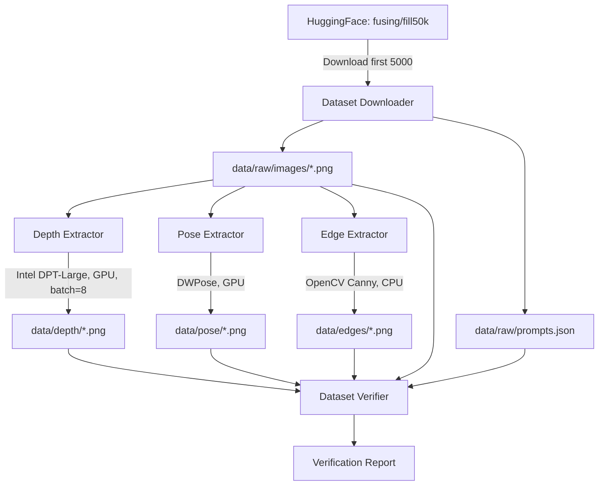

# Design Document: Data Pipeline

## Overview

This design describes the complete data pipeline for ControlNet training, covering dataset download from HuggingFace, three conditioning map extraction stages (depth, pose, edge), and dataset verification. The pipeline is optimized for Google Colab T4 GPU (15GB VRAM, ~13GB usable) and produces training-ready paired data: source image + conditioning map + text prompt.

The pipeline processes the "fusing/fill50k" dataset (first 5000 examples) through five sequential stages:

1. **Download** — Fetch dataset from HuggingFace, save images as PNGs and prompts as JSON
2. **Depth Extraction** — Generate depth maps using Intel DPT-Large (GPU, batch size 8)
3. **Pose Extraction** — Generate pose skeletons using DWPose via controlnet_aux (GPU)
4. **Edge Extraction** — Generate edge maps using OpenCV Canny (CPU-only)
5. **Verification** — Validate completeness and integrity of all outputs

Each stage supports checkpoint/resume to handle Colab session interruptions gracefully.

### Design Decisions

- **Sequential stages over monolithic pipeline**: Each extractor is an independent script that reads from `data/raw/images/` and writes to its own output directory. This allows re-running individual stages without repeating earlier work.
- **File-existence-based checkpointing**: Rather than maintaining a separate checkpoint file, each extractor checks if the output file already exists and skips it. This is simple, robust, and survives Colab resets without any state management.
- **Batch size 8 for depth only**: DPT-Large is the most VRAM-intensive model. Batch size 8 fits within ~13GB usable VRAM with FP16. Pose uses single-image inference (controlnet_aux API). Edge is CPU-only and processes sequentially.
- **Existing config integration**: The pipeline uses `configs/base_config.py` for path configuration (`PathConfig`) and condition-specific settings (`get_condition_config()`), but each script is self-contained and runnable independently.

## Architecture



### Module Layout

All pipeline scripts live in `src/data/`:

| Module | File | Device | Description |
|--------|------|--------|-------------|
| Dataset Downloader | `src/data/download_dataset.py` | CPU | Downloads fusing/fill50k, saves images + prompts |
| Depth Extractor | `src/data/extract_depth_maps.py` | GPU (T4) | DPT-Large depth estimation, batch=8 |
| Pose Extractor | `src/data/extract_pose_maps.py` | GPU (T4) | DWPose skeleton rendering |
| Edge Extractor | `src/data/extract_edge_maps.py` | CPU | OpenCV Canny edge detection |
| Dataset Verifier | `src/data/verify_completeness.py` | CPU | Validates all outputs exist and are loadable |

### Data Flow

```
fusing/fill50k (HuggingFace)
    │
    ▼
data/raw/images/00000.png ... 04999.png   (512x512 source images)
data/raw/prompts.json                      (filename → prompt mapping)
data/raw/bad_files.log                     (failed images log)
    │
    ├──► data/depth/00000.png ... 04999.png   (512x512 grayscale depth maps)
    ├──► data/pose/00000.png ... 04999.png    (512x512 RGB pose skeletons)
    └──► data/edges/00000.png ... 04999.png   (original-size binary edge maps)
```

## Components and Interfaces

### 1. Dataset Downloader (`download_dataset.py`)

```python
class DatasetDownloader:
    """Downloads fusing/fill50k from HuggingFace and saves locally."""
    
    def __init__(self, output_dir: str = "data/raw", num_samples: int = 5000, max_retries: int = 3, retry_delay: float = 5.0):
        ...
    
    def download(self) -> DownloadStats:
        """
        Download dataset, save images and prompts.
        
        Returns:
            DownloadStats with counts of valid/invalid images, 
            average dimensions, and first prompt text.
        """
        ...
    
    def _save_image(self, image: PIL.Image, index: int) -> bool:
        """Save single image as zero-padded PNG. Returns True if valid."""
        ...
    
    def _validate_image(self, image: PIL.Image, filename: str) -> bool:
        """Check image is not corrupted and has valid dimensions."""
        ...

@dataclass
class DownloadStats:
    total_valid: int
    total_invalid: int
    avg_width: float
    avg_height: float
    first_prompt: str
```

### 2. Depth Extractor (`extract_depth_maps.py`)

```python
class DepthMapExtractor:
    """Extracts depth maps using Intel DPT-Large with batch processing."""
    
    def __init__(self, input_dir: str = "data/raw/images", output_dir: str = "data/depth", 
                 batch_size: int = 8, device: str = "cuda"):
        ...
    
    def extract_all(self) -> None:
        """Process all images, skipping already-processed ones."""
        ...
    
    def _process_batch(self, image_paths: List[Path]) -> List[np.ndarray]:
        """
        Process a batch of images through DPT.
        Returns list of 512x512 grayscale depth maps (uint8, 0-255).
        """
        ...
    
    def _normalize_depth(self, raw_depth: np.ndarray) -> np.ndarray:
        """Per-image min-max normalization to [0, 255] uint8."""
        ...
    
    def _display_samples(self, processed_paths: List[Path]) -> None:
        """Display 3 depth maps at equal intervals with originals."""
        ...
```

### 3. Pose Extractor (`extract_pose_maps.py`)

```python
class PoseMapExtractor:
    """Extracts pose skeletons using DWPose from controlnet_aux."""
    
    def __init__(self, input_dir: str = "data/raw/images", output_dir: str = "data/pose"):
        ...
    
    def extract_all(self) -> None:
        """Process all images, skipping already-processed ones."""
        ...
    
    def _process_image(self, image: PIL.Image) -> np.ndarray:
        """
        Run DWPose inference. Returns 512x512 RGB pose skeleton.
        Returns blank black image if no keypoints detected.
        """
        ...
    
    def _display_samples(self, processed_paths: List[Path]) -> None:
        """Display 3 pose skeletons (preferring detected poses) with originals."""
        ...
```

### 4. Edge Extractor (`extract_edge_maps.py`)

```python
class EdgeMapExtractor:
    """Extracts edge maps using OpenCV Canny on CPU."""
    
    def __init__(self, input_dir: str = "data/raw/images", output_dir: str = "data/edges",
                 low_threshold: int = 100, high_threshold: int = 200):
        ...
    
    def extract_all(self) -> None:
        """Process all images on CPU, skipping already-processed ones."""
        ...
    
    def _process_image(self, image_path: Path) -> np.ndarray:
        """
        Apply Canny edge detection.
        Returns binary edge map (same dimensions as source, values 0 or 255).
        """
        ...
    
    def _display_samples(self, processed_paths: List[Path]) -> None:
        """Display first 3 edge maps side by side with originals."""
        ...
```

### 5. Dataset Verifier (`verify_completeness.py`)

```python
class DatasetVerifier:
    """Verifies completeness of all pipeline outputs."""
    
    def __init__(self, data_root: str = "data"):
        ...
    
    def verify(self) -> VerificationReport:
        """
        Check all samples have source image, depth, pose, edge, and prompt.
        
        Returns:
            VerificationReport with complete/incomplete counts and details.
        """
        ...
    
    def _check_sample(self, stem: str) -> SampleStatus:
        """Check a single sample for all required files."""
        ...
    
    def _validate_image_file(self, path: Path) -> bool:
        """Check file is loadable, >0 bytes, >=256x256."""
        ...

@dataclass
class VerificationReport:
    total_samples: int
    complete_samples: int
    incomplete_samples: int
    missing_details: Dict[str, List[str]]  # stem → list of missing/invalid files

@dataclass
class SampleStatus:
    stem: str
    has_source: bool
    has_depth: bool
    has_pose: bool
    has_edge: bool
    has_prompt: bool
    prompt_valid: bool
    all_loadable: bool
```

## Data Models

### Directory Structure

```
data/
├── raw/
│   ├── images/
│   │   ├── 00000.png
│   │   ├── 00001.png
│   │   └── ... (up to 04999.png)
│   ├── prompts.json
│   └── bad_files.log
├── depth/
│   ├── 00000.png
│   └── ... (512x512 grayscale)
├── pose/
│   ├── 00000.png
│   └── ... (512x512 RGB)
└── edges/
    ├── 00000.png
    └── ... (same dims as source, binary)
```

### File Formats

| Output | Format | Dimensions | Channels | Value Range |
|--------|--------|-----------|----------|-------------|
| Source images | PNG | Variable (from dataset) | RGB (3) | 0-255 |
| Depth maps | PNG (grayscale) | 512×512 | 1 | 0-255 (min-max normalized) |
| Pose skeletons | PNG (RGB) | 512×512 | 3 | 0-255 (skeleton on black) |
| Edge maps | PNG (grayscale) | Same as source | 1 | 0 or 255 (binary) |

### prompts.json Schema

```json
{
  "00000.png": "a red circle on a white background",
  "00001.png": "a blue square with green border",
  ...
}
```

Keys are filenames (with `.png` extension), values are prompt strings.

### bad_files.log Format

```
00042.png corrupted file: cannot identify image
00187.png invalid dimensions: width=0 height=512
```

One entry per line: filename followed by error reason.

### Configuration Integration

The pipeline leverages existing `configs/base_config.py`:

```python
# Path configuration (from PathConfig)
paths.raw_data_dir = "./data/raw"
paths.condition_maps_dir = "./data/condition_maps"

# Condition-specific config (from BaseConfig.get_condition_config())
depth_config = {
    "model_name": "Intel/dpt-large",
    "conditioning_channels": 1,
    "preprocessing": "normalize_depth",
    "color_mode": "grayscale"
}
edge_config = {
    "model_name": "canny",
    "low_threshold": 100,
    "high_threshold": 200
}
```

### Memory Budget (T4 GPU)

| Stage | Model Size | Batch Memory | Total VRAM |
|-------|-----------|--------------|------------|
| Depth (DPT-Large FP16) | ~1.5 GB | ~8 × 0.5 GB = 4 GB | ~5.5 GB |
| Pose (DWPose) | ~2 GB | ~1 × 1 GB | ~3 GB |
| Edge (Canny) | N/A (CPU) | N/A | 0 GB |

Depth extraction at batch size 8 with FP16 stays well within the ~13GB usable VRAM budget.


## Correctness Properties

*A property is a characteristic or behavior that should hold true across all valid executions of a system — essentially, a formal statement about what the system should do. Properties serve as the bridge between human-readable specifications and machine-verifiable correctness guarantees.*

### Property 1: Filename zero-padding format

*For any* integer index in the range [0, 4999], the filename formatting function SHALL produce a string of exactly 5 digits followed by ".png" (e.g., index 0 → "00000.png", index 4999 → "04999.png").

**Validates: Requirements 1.3**

### Property 2: Prompts JSON round-trip

*For any* valid mapping of filenames (strings matching `\d{5}\.png`) to non-empty prompt strings, serializing the mapping to JSON and deserializing it back SHALL produce an identical mapping.

**Validates: Requirements 1.4**

### Property 3: Image dimension validation

*For any* PIL Image, the validation function SHALL return True if and only if the image has width > 0 and height > 0. For any image with width = 0 or height = 0, it SHALL return False.

**Validates: Requirements 1.6**

### Property 4: Depth min-max normalization

*For any* 2D numpy array of floats where max > min, applying per-image min-max normalization to the [0, 255] integer range SHALL produce an output where the minimum value is 0, the maximum value is 255, and all values are integers in [0, 255] inclusive.

**Validates: Requirements 2.2**

### Property 5: Output path stem preservation

*For any* source image filename with a valid stem (e.g., "00042.png"), the output path construction for depth, pose, and edge extractors SHALL produce a path in the respective output directory with the same stem and a ".png" extension.

**Validates: Requirements 2.3, 3.4, 4.2**

### Property 6: Checkpoint skip-if-exists

*For any* set of source images and any subset of those images that already have corresponding output files in the target directory, the extractor SHALL process only the images whose output files do not yet exist. The set of processed images SHALL equal the set difference of all source images minus those with existing outputs.

**Validates: Requirements 2.5, 3.5, 4.4**

### Property 7: Blank pose for undetected keypoints

*For any* image where the pose detector returns no keypoints, the output pose map SHALL be a numpy array of shape (512, 512, 3) with dtype uint8 where every pixel value is exactly 0.

**Validates: Requirements 3.3**

### Property 8: Edge map binary output with dimension preservation

*For any* source image of dimensions (H, W), the edge map produced by Canny detection SHALL have dimensions (H, W) with a single channel, and every pixel value SHALL be either 0 or 255 (no intermediate values).

**Validates: Requirements 4.1, 4.8**

### Property 9: Verification completeness invariant

*For any* set of sample stems and any arrangement of files across the four directories (raw/images, depth, pose, edges) with a prompts.json, the count of "complete" samples reported by the verifier SHALL equal the number of stems where all four image files exist, are loadable, meet size requirements, and have a valid prompt entry.

**Validates: Requirements 5.1, 5.6**

### Property 10: Prompt validation logic

*For any* string, the prompt validator SHALL return True if and only if the string has at least 5 characters (after any whitespace is considered). Empty strings, strings shorter than 5 characters, and null/missing entries SHALL return False.

**Validates: Requirements 5.2**

### Property 11: Conditioning map file validation

*For any* file path, the conditioning map validator SHALL return True if and only if the file exists, has size > 0 bytes, is decodable as an image, and has dimensions of at least 256×256 pixels.

**Validates: Requirements 5.3**

### Property 12: Statistics computation correctness

*For any* list of (width, height) pairs representing valid image dimensions, the computed average width SHALL equal the arithmetic mean of all widths, and the computed average height SHALL equal the arithmetic mean of all heights.

**Validates: Requirements 1.8**

## Error Handling

### Dataset Download Errors

| Error Condition | Handling Strategy | Recovery |
|----------------|-------------------|----------|
| Network failure during HuggingFace download | Retry up to 3 times with 5-second delay | Raise with descriptive message after exhausting retries |
| Corrupted/invalid image in dataset | Log to `bad_files.log`, skip image, continue | Final count reflects valid images only |
| Disk full during image save | Raise IOError immediately | User must free space and re-run |
| Invalid image dimensions (0 width/height) | Log to `bad_files.log`, skip | Continue with remaining images |

### Extraction Errors

| Error Condition | Handling Strategy | Recovery |
|----------------|-------------------|----------|
| GPU OOM during depth batch | Reduce batch size, retry individual images | Continue with smaller batches |
| Corrupted source image (unreadable) | Log warning, skip image | Continue processing remaining |
| DPT model fails on specific image | Log error with filename, skip | Continue with next image |
| DWPose model error | Log error, skip image | Continue processing |
| Canny receives non-image file | Log warning, skip | Continue processing |

### Verification Errors

| Error Condition | Handling Strategy | Recovery |
|----------------|-------------------|----------|
| `prompts.json` missing | Print error, halt verification | User must re-run download stage |
| `prompts.json` invalid JSON | Print error, halt verification | User must re-run download stage |
| Conditioning map file unreadable | Flag sample as incomplete | Report in summary |
| Image below 256×256 minimum | Flag sample as incomplete | Report in summary |

### Logging Strategy

- **Download stage**: `bad_files.log` for invalid images (append mode)
- **Extraction stages**: Python `logging` module at WARNING level for skipped files
- **Verification stage**: stdout for sample-level issues, final summary line

## Testing Strategy

### Property-Based Testing

This feature is suitable for property-based testing because it contains multiple pure functions with clear input/output behavior (normalization, validation, path construction, statistics computation) where universal properties hold across a wide input space.

**Library**: `hypothesis` (Python PBT library)
**Configuration**: Minimum 100 iterations per property test

Each property test references its design document property:
- Tag format: **Feature: data-pipeline, Property {number}: {property_text}**

### Unit Tests (Example-Based)

| Test | Validates | Description |
|------|-----------|-------------|
| `test_download_limits_to_5000` | Req 1.2 | Mock HuggingFace, verify only 5000 selected |
| `test_retry_on_network_failure` | Req 1.9 | Mock failures, verify 3 retries with delay |
| `test_bad_file_logging` | Req 1.7 | Inject invalid image, verify log entry |
| `test_depth_batch_size_8` | Req 2.4 | Verify batching groups of 8 |
| `test_depth_display_equal_intervals` | Req 2.7 | Verify sample selection at equal intervals |
| `test_pose_skip_on_error` | Req 3.6 | Inject model error, verify skip |
| `test_edge_cpu_only` | Req 4.3 | Verify no CUDA calls in edge extraction |
| `test_verifier_halts_on_missing_prompts` | Req 5.4 | Remove prompts.json, verify halt |
| `test_verifier_output_format` | Req 5.7 | Verify "X samples ready for training" format |
| `test_tqdm_progress_bars` | Req 1.5, 2.8, 3.8, 4.6 | Verify progress bars are displayed |

### Integration Tests

| Test | Validates | Description |
|------|-----------|-------------|
| `test_download_small_subset` | Req 1.1-1.4 | Download 10 images from fusing/fill50k, verify files |
| `test_depth_extraction_end_to_end` | Req 2.1-2.3 | Process 5 images through DPT, verify outputs |
| `test_pose_extraction_end_to_end` | Req 3.1-3.4 | Process 5 images through DWPose, verify outputs |
| `test_edge_extraction_end_to_end` | Req 4.1-4.2 | Process 5 images through Canny, verify outputs |
| `test_full_pipeline_small` | All | Run all stages on 10 images, verify completeness |

### Documentation Tests (Static Analysis)

| Test | Validates | Description |
|------|-----------|-------------|
| `test_depth_docstring_present` | Req 6.1 | Verify module docstring exists and ≥30 words |
| `test_pose_docstring_present` | Req 6.2 | Verify module docstring exists and ≥30 words |
| `test_edge_docstring_present` | Req 6.3 | Verify module docstring exists and ≥30 words |
| `test_canny_threshold_comments` | Req 6.4 | Verify inline comments near threshold params |

### Test Organization

```
tests/
├── test_data_pipeline/
│   ├── test_download.py          # Download unit + integration tests
│   ├── test_depth_extraction.py  # Depth unit + integration tests
│   ├── test_pose_extraction.py   # Pose unit + integration tests
│   ├── test_edge_extraction.py   # Edge unit + integration tests
│   ├── test_verification.py      # Verifier unit + integration tests
│   ├── test_properties.py        # All property-based tests (hypothesis)
│   └── test_documentation.py     # Docstring/comment checks
```
