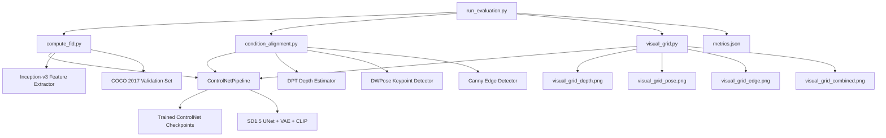
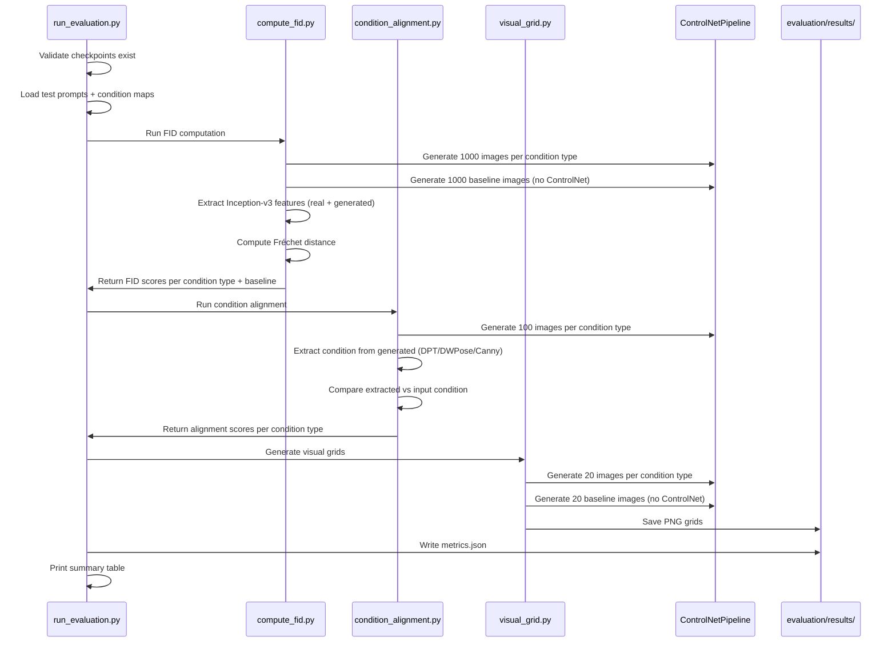

# Technical Design Document

## Overview

This document presents the technical design for the complete evaluation pipeline that produces quantitative metrics and qualitative visualizations for the 3 trained ControlNet adapters (depth, pose, edge). The pipeline evaluates generation quality using FID scores, measures condition adherence using alignment metrics, and produces visual comparison grids for demonstration purposes.

The implementation consists of four modules:
- `evaluation/compute_fid.py` — FID score computation against COCO 2017 validation set
- `evaluation/condition_alignment.py` — Condition following measurement (SSIM, correlation, keypoint distance)
- `evaluation/visual_grid.py` — 4-column comparison grid generation
- `evaluation/run_evaluation.py` — Pipeline orchestrator with CLI interface

### Key Design Principles

1. **Reuse Existing Infrastructure**: Leverages the existing `model/pipeline.py` ControlNetPipeline for all image generation
2. **Graceful Degradation**: Missing checkpoints or failed modules don't abort the entire pipeline
3. **T4 Memory Efficiency**: Batch processing with configurable batch sizes to stay within 15GB VRAM
4. **Reproducibility**: Fixed seeds for generation, structured JSON output for exact metric reporting

## Architecture

### System Architecture



### Data Flow



## Components and Interfaces

### 1. FID Score Computation (`evaluation/compute_fid.py`)

```python
class EvaluationFIDCalculator:
    """
    Computes FID scores for trained ControlNet adapters against COCO validation set.
    
    Generates images using the ControlNetPipeline, extracts Inception-v3 features
    from both real (COCO) and generated images, and computes the Fréchet distance.
    Also computes a vanilla SD1.5 baseline for comparison.
    """
    
    def __init__(
        self,
        pipeline: ControlNetPipeline,
        coco_val_dir: str,
        batch_size: int = 32,
        device: torch.device = None,
    ):
        """
        Args:
            pipeline: Loaded ControlNetPipeline for image generation
            coco_val_dir: Path to COCO 2017 validation images
            batch_size: Batch size for Inception-v3 feature extraction
            device: Computation device (default: cuda if available)
        """
        ...
    
    def generate_images(
        self,
        prompts: List[str],
        condition_maps: List[Image.Image],
        condition_type: str,
        num_images: int = 1000,
        seed: int = 42,
    ) -> List[Image.Image]:
        """Generate images using the ControlNet pipeline."""
        ...
    
    def generate_baseline_images(
        self,
        prompts: List[str],
        num_images: int = 1000,
        seed: int = 42,
    ) -> List[Image.Image]:
        """Generate images using vanilla SD1.5 (no ControlNet)."""
        ...
    
    def compute_fid_for_condition(
        self,
        condition_type: str,
        prompts: List[str],
        condition_maps: List[Image.Image],
        num_images: int = 1000,
    ) -> float:
        """Compute FID for a single condition type."""
        ...
    
    def run_full_evaluation(
        self,
        prompts: List[str],
        condition_maps: Dict[str, List[Image.Image]],
        num_images: int = 1000,
    ) -> Dict[str, float]:
        """
        Run FID evaluation for all condition types + baseline.
        
        Returns:
            Dict with keys: 'baseline', 'depth', 'pose', 'edge'
            Values are FID scores (float).
        """
        ...
    
    def print_results_table(self, results: Dict[str, float]) -> None:
        """Print formatted results table."""
        ...
```

### 2. Condition Alignment (`evaluation/condition_alignment.py`)

```python
class EvaluationAlignmentCalculator:
    """
    Measures how well generated images follow their conditioning signals.
    
    For each condition type, uses a specialized extraction + comparison method:
    - Edge: Canny on generated → SSIM vs input edge map
    - Depth: DPT on generated → Pearson correlation vs input depth map
    - Pose: DWPose on generated → normalized keypoint distance vs input pose
    """
    
    def __init__(
        self,
        pipeline: ControlNetPipeline,
        device: torch.device = None,
    ):
        ...
    
    def compute_edge_alignment(
        self,
        generated_image: Image.Image,
        input_edge_map: Image.Image,
    ) -> float:
        """
        Compute SSIM between Canny edges of generated image and input edge map.
        Returns SSIM score in [0, 1].
        """
        ...
    
    def compute_depth_alignment(
        self,
        generated_image: Image.Image,
        input_depth_map: Image.Image,
    ) -> float:
        """
        Run DPT on generated image, compute Pearson correlation with input depth.
        Returns correlation in [-1, 1], typically [0, 1] for good alignment.
        """
        ...
    
    def compute_pose_alignment(
        self,
        generated_image: Image.Image,
        input_pose_map: Image.Image,
    ) -> float:
        """
        Run DWPose on generated image, compute normalized keypoint distance.
        Returns 1 - normalized_distance, so higher = better alignment.
        Score in [0, 1].
        """
        ...
    
    def evaluate_condition_type(
        self,
        condition_type: str,
        prompts: List[str],
        condition_maps: List[Image.Image],
        num_samples: int = 100,
    ) -> Tuple[float, float]:
        """
        Evaluate alignment for a condition type.
        Returns (mean_score, std_score).
        """
        ...
    
    def run_full_evaluation(
        self,
        prompts: List[str],
        condition_maps: Dict[str, List[Image.Image]],
        num_samples: int = 100,
    ) -> Dict[str, Tuple[float, float]]:
        """
        Run alignment evaluation for all condition types.
        Returns dict mapping condition_type → (mean, std).
        """
        ...
```

### 3. Visual Grid Generator (`evaluation/visual_grid.py`)

```python
class EvaluationGridGenerator:
    """
    Generates 4-column comparison grids for qualitative evaluation.
    
    Columns: Original Image | Condition Map | With ControlNet | Without ControlNet
    """
    
    def __init__(
        self,
        pipeline: ControlNetPipeline,
        cell_size: Tuple[int, int] = (256, 256),
        output_dir: str = "evaluation/results",
    ):
        ...
    
    def generate_grid(
        self,
        condition_type: str,
        original_images: List[Image.Image],
        condition_maps: List[Image.Image],
        prompts: List[str],
        num_rows: int = 20,
        seed: int = 42,
    ) -> Image.Image:
        """
        Generate a 4-column grid for one condition type.
        
        Columns:
            1. Original image
            2. Condition map (depth/pose/edge)
            3. Generated with ControlNet
            4. Generated without ControlNet (vanilla SD1.5)
        
        Returns the grid as a PIL Image.
        """
        ...
    
    def generate_combined_grid(
        self,
        original_images: List[Image.Image],
        condition_maps: Dict[str, List[Image.Image]],
        prompts: List[str],
        num_rows: int = 5,
        seed: int = 42,
    ) -> Image.Image:
        """
        Generate a combined grid showing all 3 condition types on same inputs.
        """
        ...
    
    def save_all_grids(
        self,
        original_images: List[Image.Image],
        condition_maps: Dict[str, List[Image.Image]],
        prompts: List[str],
    ) -> List[str]:
        """
        Generate and save all grids (per-condition + combined).
        Returns list of saved file paths.
        """
        ...
```

### 4. Pipeline Orchestrator (`evaluation/run_evaluation.py`)

```python
def parse_args() -> argparse.Namespace:
    """Parse command-line arguments for the evaluation pipeline."""
    ...

def load_pipeline(
    condition_type: str,
    checkpoint_dir: str,
    device: torch.device,
) -> Optional[ControlNetPipeline]:
    """
    Load the ControlNetPipeline with a trained adapter checkpoint.
    Returns None if checkpoint not found.
    """
    ...

def load_test_data(
    coco_val_dir: str,
    num_prompts: int = 20,
) -> Tuple[List[str], List[Image.Image], Dict[str, List[Image.Image]]]:
    """
    Load test prompts, original images, and condition maps.
    Returns (prompts, original_images, condition_maps_by_type).
    """
    ...

def run_evaluation(args: argparse.Namespace) -> Dict:
    """
    Main evaluation pipeline orchestrator.
    
    1. Validate checkpoints
    2. Run FID computation
    3. Run condition alignment
    4. Generate visual grids
    5. Save metrics.json
    6. Print summary
    """
    ...

if __name__ == "__main__":
    args = parse_args()
    run_evaluation(args)
```

## Data Models

### Metrics JSON Schema

```json
{
  "metadata": {
    "timestamp": "2024-01-15T10:30:00Z",
    "num_fid_samples": 1000,
    "num_alignment_samples": 100,
    "coco_val_size": 1000,
    "inference_config": {
      "guidance_scale": 7.5,
      "num_inference_steps": 20,
      "image_size": 512
    },
    "checkpoint_paths": {
      "depth": "models/trained/controlnet-sd15-depth",
      "pose": "models/trained/controlnet-sd15-pose",
      "edge": "models/trained/controlnet-sd15-edge"
    }
  },
  "fid_scores": {
    "baseline_sd15": 45.2,
    "depth": 17.3,
    "pose": 16.8,
    "edge": 17.9
  },
  "alignment_scores": {
    "depth": {
      "mean": 0.74,
      "std": 0.08,
      "num_samples": 100,
      "metric": "pearson_correlation",
      "target_met": true
    },
    "pose": {
      "mean": 0.72,
      "std": 0.11,
      "num_samples": 100,
      "metric": "normalized_keypoint_distance",
      "target_met": true
    },
    "edge": {
      "mean": 0.76,
      "std": 0.06,
      "num_samples": 100,
      "metric": "ssim",
      "target_met": true
    }
  },
  "visual_grids": {
    "depth": "evaluation/results/visual_grid_depth.png",
    "pose": "evaluation/results/visual_grid_pose.png",
    "edge": "evaluation/results/visual_grid_edge.png",
    "combined": "evaluation/results/visual_grid_combined.png"
  }
}
```

### Configuration Dataclass

```python
@dataclass
class EvaluationConfig:
    output_dir: str = "evaluation/results"
    num_fid_samples: int = 1000
    num_alignment_samples: int = 100
    num_grid_prompts: int = 20
    batch_size: int = 32
    condition_types: List[str] = field(default_factory=lambda: ["depth", "pose", "edge"])
    coco_val_dir: str = "data/raw/coco_val2017"
    checkpoint_dir: str = "models/trained"
    guidance_scale: float = 7.5
    num_inference_steps: int = 20
    seed: int = 42
```

## Correctness Properties

*A property is a characteristic or behavior that should hold true across all valid executions of a system — essentially, a formal statement about what the system should do. Properties serve as the bridge between human-readable specifications and machine-verifiable correctness guarantees.*

### Property 1: Inception-v3 Feature Shape Invariant

*For any* batch of valid RGB images (of any size ≥ 1), extracting Inception-v3 features SHALL always produce an output array of shape (N, 2048) where N equals the number of input images.

**Validates: Requirements 1.3**

### Property 2: Alignment Score Bounded Range

*For any* condition type (depth, pose, or edge) and *for any* pair of valid images (generated image and condition map), the computed alignment score SHALL always be in the range [0, 1].

**Validates: Requirements 2.1, 2.2, 2.3**

### Property 3: Aggregation Statistics Invariant

*For any* non-empty list of alignment scores where each score is in [0, 1], the computed mean SHALL be between the minimum and maximum values in the list, and the computed standard deviation SHALL be non-negative.

**Validates: Requirements 2.5**

### Property 4: Grid Dimension Invariant

*For any* number of rows (1 to 20), cell size, and padding configuration, the generated visual grid image dimensions SHALL equal: width = 4 × cell_width + 5 × padding, height = num_rows × cell_height + (num_rows + 1) × padding + header_height + label_heights.

**Validates: Requirements 3.1**

### Property 5: Metrics JSON Round-Trip

*For any* valid metrics dictionary containing FID scores, alignment scores, and metadata, serializing to JSON and deserializing back SHALL produce a dictionary equivalent to the original (round-trip property).

**Validates: Requirements 4.1**

### Property 6: Metrics JSON Schema Completeness

*For any* combination of evaluated condition types (1 to 3 types) and their corresponding scores, the generated metrics JSON SHALL contain all required top-level keys ("metadata", "fid_scores", "alignment_scores", "visual_grids") and each condition type's scores SHALL be present under the appropriate section.

**Validates: Requirements 4.2, 4.3**

### Property 7: Pipeline Resilience to Module Failure

*For any* single evaluation module (FID, alignment, or grid) that raises an exception, the pipeline orchestrator SHALL still execute the remaining modules and produce partial results for the modules that succeeded.

**Validates: Requirements 5.5**

## Error Handling

### Module-Level Errors

| Error Scenario | Detection | Recovery |
|---|---|---|
| Missing ControlNet checkpoint | `FileNotFoundError` when loading | Skip condition type, log warning, continue |
| COCO validation set not found | `FileNotFoundError` on directory | Abort FID computation, continue with alignment/grid |
| GPU OOM during feature extraction | `torch.cuda.OutOfMemoryError` | Reduce batch size by half, retry |
| Inception-v3 download failure | Network error | Use cached model or abort FID with error message |
| DPT/DWPose model load failure | Import/download error | Fall back to lightweight proxy (Laplacian/Canny) |
| Invalid image in COCO set | Corrupt file | Skip image, log warning, continue with remaining |

### Pipeline-Level Errors

| Error Scenario | Detection | Recovery |
|---|---|---|
| No checkpoints found for any condition | Validation at startup | Abort with clear error message listing expected paths |
| FID module fails entirely | Exception caught in orchestrator | Log error, continue with alignment and grid modules |
| Alignment module fails entirely | Exception caught in orchestrator | Log error, continue with grid module |
| Grid module fails entirely | Exception caught in orchestrator | Log error, save partial metrics.json |
| Output directory not writable | `PermissionError` | Attempt fallback to current directory |

### Error Handling Strategy

```python
# In run_evaluation.py orchestrator:
results = {}

for module_name, module_fn in [("fid", run_fid), ("alignment", run_alignment), ("grid", run_grid)]:
    try:
        results[module_name] = module_fn(config)
    except Exception as e:
        logger.error(f"Module '{module_name}' failed: {e}")
        results[module_name] = {"error": str(e)}
        # Continue with remaining modules

# Always attempt to save whatever results we have
save_metrics_json(results, config.output_dir)
```

## Testing Strategy

### Unit Tests

1. **FID feature extraction**: Verify Inception-v3 produces (N, 2048) features for synthetic images
2. **Fréchet distance computation**: Verify FID=0 for identical distributions, FID>0 for different ones
3. **Edge alignment (SSIM)**: Verify SSIM=1.0 for identical images, SSIM<1.0 for different images
4. **Depth alignment (correlation)**: Verify correlation=1.0 for identical maps, bounded in [-1, 1]
5. **Pose alignment (keypoint distance)**: Verify distance=0 for identical poses, bounded in [0, 1]
6. **Grid generation**: Verify output image dimensions match expected formula
7. **JSON serialization**: Verify round-trip fidelity and schema completeness
8. **CLI argument parsing**: Verify defaults and custom values are handled correctly

### Property-Based Tests (using Hypothesis)

Property-based tests validate universal properties across randomly generated inputs. Each test runs a minimum of 100 iterations.

1. **Property 1**: Generate random batches of images (varying N from 1 to 50), extract features, assert shape is always (N, 2048)
2. **Property 2**: Generate random image pairs, compute alignment for each condition type, assert score is always in [0, 1]
3. **Property 3**: Generate random lists of floats in [0, 1], compute mean and std, assert mean is bounded and std ≥ 0
4. **Property 4**: Generate random grid configurations (rows, cell_size, padding), create grid, assert dimensions match formula
5. **Property 5**: Generate random metrics dicts, serialize to JSON, deserialize, assert equality
6. **Property 6**: Generate random subsets of condition types with random scores, build metrics JSON, assert all required keys present
7. **Property 7**: Mock module failures in random combinations, run pipeline, assert remaining modules produce results

### Integration Tests

1. **End-to-end with mock pipeline**: Run full evaluation with a mock ControlNetPipeline that returns random images
2. **Metrics file output**: Verify metrics.json is created with valid structure after full run
3. **Grid file output**: Verify PNG files are created at expected paths
4. **Graceful degradation**: Verify pipeline completes when 1 or 2 condition types have missing checkpoints

### Test Configuration

- **PBT Library**: Hypothesis (Python)
- **Minimum iterations**: 100 per property test
- **Tag format**: `Feature: evaluation-pipeline, Property {N}: {title}`
- **Test location**: `tests/property/test_evaluation_properties.py`

