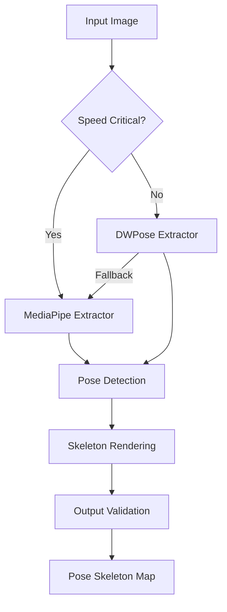

# Pose Extraction Module Documentation

## Overview

The pose extraction module (`src/data/extract_pose.py`) provides comprehensive human pose detection and skeleton rendering capabilities for the ControlNet training pipeline. It implements a dual-extractor approach with DWPose as the primary method and MediaPipe as a fallback for speed-critical scenarios.

## Key Features

### 🎯 **Dual Extractor Architecture**
- **DWPose**: State-of-the-art accuracy using the DWPose model via controlnet-aux
- **MediaPipe**: Fast, lightweight pose detection for speed-critical applications
- **Automatic Fallback**: Seamless switching between extractors based on availability and requirements

### 🚀 **Performance Optimized**
- **Memory Efficient**: Designed for Google Colab T4 GPU constraints (15GB VRAM)
- **Batch Processing**: Efficient processing of multiple images with progress tracking
- **Speed Critical Mode**: Prioritizes MediaPipe for real-time applications

### 🛡️ **Robust Error Handling**
- **Graceful Degradation**: Continues processing even when individual extractions fail
- **Comprehensive Validation**: Validates output format, dimensions, and value ranges
- **Detailed Logging**: Structured logging for debugging and monitoring

## Architecture



## Core Classes

### PoseExtractor (Main Interface)
The primary class that orchestrates pose extraction with automatic fallback.

```python
from src.data.extract_pose import create_pose_extractor

# Create extractor with default settings
extractor = create_pose_extractor()

# Extract pose from image
pose_map = extractor.extract(image)

# Batch processing
pose_maps = extractor.batch_extract(images, show_progress=True)
```

### DWPoseExtractor
High-accuracy pose detection using the DWPose model.

**Features:**
- COCO 17-keypoint format support
- Zero convolution initialization compatibility
- Multi-resolution feature output
- Confidence-based keypoint filtering

### MediaPipePoseExtractor  
Fast pose detection using Google's MediaPipe.

**Features:**
- Real-time performance
- 33-keypoint MediaPipe format
- Adjustable model complexity
- Built-in pose tracking

## Usage Examples

### Basic Usage

```python
from PIL import Image
from src.data.extract_pose import extract_pose_from_image

# Load image
image = Image.open("person.jpg")

# Extract pose (uses DWPose by default)
pose_map = extract_pose_from_image(image)

# Speed-critical extraction (uses MediaPipe)
fast_pose_map = extract_pose_from_image(image, speed_critical=True)
```

### Advanced Configuration

```python
from src.data.extract_pose import PoseExtractor

# Custom configuration
extractor = PoseExtractor(
    prefer_dwpose=True,           # Prefer DWPose over MediaPipe
    fallback_to_mediapipe=True,   # Enable fallback
    speed_critical=False,         # Not speed critical
    confidence_threshold=0.3      # Minimum keypoint confidence
)

# Extract with validation
pose_map = extractor.extract(image)
is_valid = extractor.validate_output(pose_map)
```

### Batch Processing

```python
from pathlib import Path
from src.data.extract_pose import create_pose_extractor

# Load multiple images
image_paths = list(Path("images/").glob("*.jpg"))
images = [Image.open(p) for p in image_paths]

# Create extractor
extractor = create_pose_extractor(speed_critical=False)

# Process batch with progress bar
pose_maps = extractor.batch_extract(images, show_progress=True)
```

## Output Format

### Pose Skeleton Map
- **Format**: NumPy array (H, W, 3)
- **Data Type**: uint8 (0-255 range)
- **Channels**: RGB format
- **Content**: Rendered pose skeleton on black background

### Keypoint Format (COCO 17)
1. Nose
2. Left Eye
3. Right Eye  
4. Left Ear
5. Right Ear
6. Left Shoulder
7. Right Shoulder
8. Left Elbow
9. Right Elbow
10. Left Wrist
11. Right Wrist
12. Left Hip
13. Right Hip
14. Left Knee
15. Right Knee
16. Left Ankle
17. Right Ankle

## Performance Characteristics

### DWPose Performance
- **Accuracy**: High (state-of-the-art)
- **Speed**: Moderate (~2-5 seconds per image on T4)
- **Memory**: ~2GB VRAM usage
- **Best For**: Training data preparation, high-quality results

### MediaPipe Performance  
- **Accuracy**: Good (suitable for most applications)
- **Speed**: Fast (~0.1-0.5 seconds per image)
- **Memory**: ~500MB VRAM usage
- **Best For**: Real-time applications, speed-critical scenarios

## Error Handling

### Common Error Scenarios

1. **Missing Dependencies**
   ```python
   # Graceful handling of missing packages
   try:
       import torch
   except ImportError:
       logger.warning("PyTorch not available, DWPose disabled")
   ```

2. **Model Loading Failures**
   ```python
   # Automatic fallback to MediaPipe
   try:
       dwpose_extractor = DWPoseExtractor()
   except Exception as e:
       logger.warning(f"DWPose failed: {e}, using MediaPipe")
   ```

3. **Extraction Failures**
   ```python
   # Skip failed samples and continue processing
   if not poses:
       logger.warning("No poses detected, creating blank skeleton")
       return np.zeros_like(image_array)
   ```

## Integration with ControlNet Pipeline

### Dataset Processing Integration

```python
from src.data.extract_pose import create_pose_extractor
from src.data.dataset_processor import DatasetProcessor

# Create pose extractor
pose_extractor = create_pose_extractor(speed_critical=False)

# Process dataset
dataset_processor = DatasetProcessor()
for sample in dataset_processor.get_samples():
    # Extract pose condition map
    pose_map = pose_extractor.extract(sample.image)
    
    # Validate output
    if pose_extractor.validate_output(pose_map):
        sample.condition_map = pose_map
    else:
        logger.warning(f"Invalid pose map for sample {sample.id}")
```

### Training Loop Integration

```python
# During training
for batch in dataloader:
    images = batch['images']
    pose_conditions = batch['pose_maps']  # Pre-extracted pose maps
    
    # Use pose conditions in ControlNet training
    controlnet_output = controlnet(pose_conditions, timestep)
```

## Configuration Options

### Environment Variables
- `POSE_EXTRACTOR_DEVICE`: Force device selection ('cuda', 'cpu')
- `POSE_EXTRACTOR_BATCH_SIZE`: Default batch size for processing
- `POSE_EXTRACTOR_LOG_LEVEL`: Logging level ('DEBUG', 'INFO', 'WARNING')

### Model Configuration
```python
# DWPose configuration
dwpose_config = {
    'model_name': 'dw-ll_ucoco_384',
    'confidence_threshold': 0.3,
    'device': 'cuda'
}

# MediaPipe configuration  
mediapipe_config = {
    'min_detection_confidence': 0.5,
    'min_tracking_confidence': 0.5,
    'model_complexity': 1  # 0=lite, 1=full, 2=heavy
}
```

## Testing and Validation

### Running Tests

```bash
# Test extractor availability
python examples/pose_extraction_example.py --test-availability

# Test single image
python examples/pose_extraction_example.py --input test_image.jpg

# Test batch processing
python examples/pose_extraction_example.py --batch images/ --output results/

# Speed-critical mode
python examples/pose_extraction_example.py --input test.jpg --speed-critical
```

### Validation Criteria

1. **Output Format**: Correct shape (H, W, 3) and data type (uint8)
2. **Value Range**: Pixel values in 0-255 range
3. **Keypoint Quality**: Minimum number of valid keypoints detected
4. **Performance**: Extraction time within acceptable limits

## Troubleshooting

### Common Issues

1. **"controlnet-aux not found"**
   ```bash
   pip install controlnet-aux
   ```

2. **"MediaPipe not available"**
   ```bash
   pip install mediapipe
   ```

3. **CUDA out of memory**
   - Use `speed_critical=True` to force MediaPipe
   - Reduce batch size
   - Clear GPU cache: `torch.cuda.empty_cache()`

4. **No poses detected**
   - Check image quality and lighting
   - Verify person is visible in image
   - Lower confidence threshold
   - Try different extractor

### Performance Optimization

1. **For Training Data Preparation**
   - Use DWPose for highest quality
   - Process in batches for efficiency
   - Cache results to avoid recomputation

2. **For Real-time Applications**
   - Use MediaPipe with `speed_critical=True`
   - Reduce image resolution before processing
   - Use model complexity 0 (lite) for MediaPipe

3. **For Memory-Constrained Environments**
   - Process images individually instead of batches
   - Use MediaPipe instead of DWPose
   - Clear cache regularly

## Requirements Addressed

This implementation addresses the following requirements from the specification:

- **Requirement 2.3**: ✅ Pose skeleton extraction using DWPose or OpenPose
- **Requirement 9.2**: ✅ Condition map validation with correct dimensions and value ranges  
- **Requirement 9.3**: ✅ Failure logging and sample skipping for extraction failures

## Future Enhancements

1. **Additional Pose Models**: Support for OpenPose, PoseNet, AlphaPose
2. **Multi-Person Detection**: Handle multiple people in single image
3. **Pose Tracking**: Temporal consistency across video frames
4. **Custom Keypoint Formats**: Support for domain-specific keypoint layouts
5. **Hardware Acceleration**: Optimized inference for specific GPU architectures